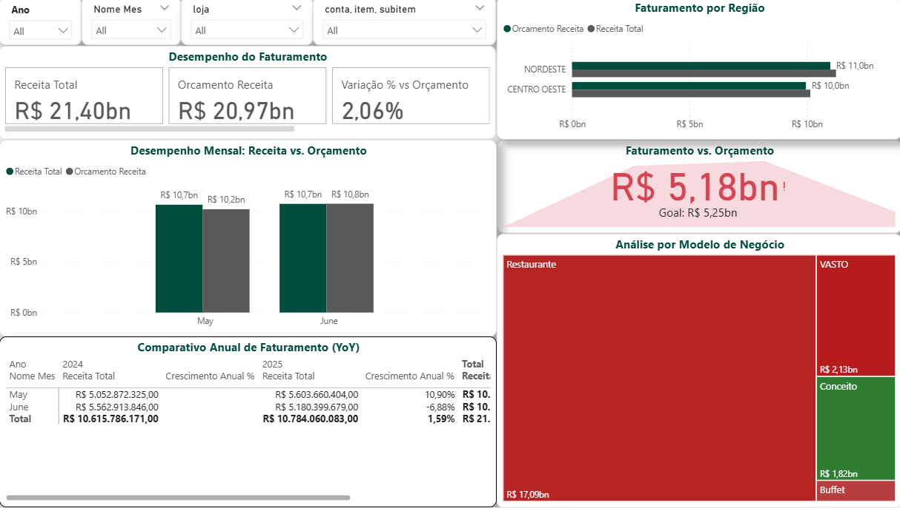
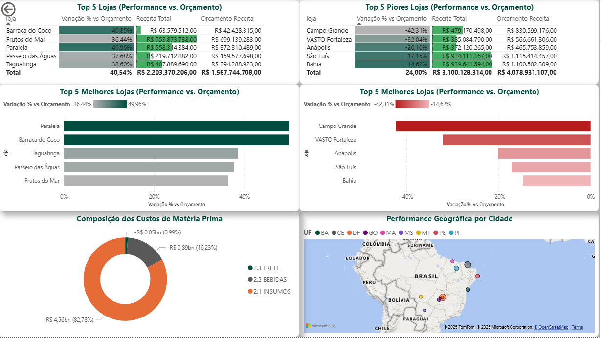

```markdown
# Análise Estratégica de Performance - Coco Bambu

## Projeto: Dashboard Estratégico de Análise de Receita e Orçamento

**Candidato(a):** Tassio Lucian de Jesus Sales  
**Data:** 20 de Agosto de 2025



Visão geral do dashboard interativo

### 1. Decisões Estratégicas de Modelagem e ETL

#### Modelagem de Dados

A arquitetura do projeto foi desenvolvida com foco em performance, escalabilidade e experiência do usuário final, permitindo que os insights fossem extraídos de forma rápida e intuitiva.

| Estrutura de Dados | Esquema Estrela | Modelo dimensional otimizado |
|--------------------|-----------------|------------------------------|
| Tabelas Principais | 4               | Fato, Dimensões e Calendário |
| Relacionamentos    | Otimizados      | Integridade referencial garantida |

**Principais Características:**
- **Esquema Estrela (Star Schema)** com tabela Fato centralizada para consultas eficientes
- **Tabela Calendário em DAX** dinâmica para análises temporais avançadas (YoY, MTD, QTD, YTD)
- Relacionamentos otimizados entre dimensões (Campos, Lojas) e fatos garantindo consistência
- Hierarquias bem definidas para navegação intuitiva (Ano > Mês > Dia)
- Medidas calculadas para métricas de negócio complexas

#### Tratamento e Preparação dos Dados (Power Query - ETL)

**Processo ETL Robusto**  
Foram implementadas transformações avançadas no Power Query para garantir a qualidade e consistência dos dados.

**Transformação de Datas**  
- Padronização do formato de data  
- Extração de dia, mês, ano, trimestre  
- Criação de hierarquias temporais  

**Limpeza de Dados**  
- Tratamento de valores nulos  
- Padronização de formatos  
- Validação de consistência  

**Enriquecimento Geográfico**  
- Separação de Cidade/UF  
- Agregação por região  
- Preparação para visualizações de mapa  

**Exemplo de Código Power Query**

```m
// Transformação de Data
let
    Source = Excel.Workbook(File.Contents("Caminho\\Arquivo.xlsx"), null, true),
    Fato_Sheet = Source{[Item="Fato",Kind="Sheet"]}[Data],
    #"Cabeçalhos Promovidos" = Table.PromoteHeaders(Fato_Sheet, [PromoteAllScalars=true]),
    #"Tipo Alterado" = Table.TransformColumnTypes(#"Cabeçalhos Promovidos",{{"mes_ano", type date}})
in
    #"Tipo Alterado"

// Tratamento de Nulos
let
    Source = ...
    #"Valores Substituídos" = Table.ReplaceValue(Source,null,0,Replacer.ReplaceValue,{"valor", "valor_orcado"})
in
    #"Valores Substituídos"

// Separação Cidade-UF
let
    Source = ...
    #"Colunas Divididas" = Table.SplitColumn(Source, "cidade", 
        Splitter.SplitTextByDelimiter("-", QuoteStyle.Csv), {"cidade", "uf"})
in
    #"Colunas Divididas"
```

### 2. Arquitetura Visual e Análises Desenvolvidas

#### Visão Geral do Dashboard

O dashboard foi projetado seguindo princípios de design thinking e análise de negócios, organizado em camadas analíticas que permitem uma navegação intuitiva dos indicadores macro até os detalhes operacionais.



Visão detalhada das métricas e análises do dashboard interativo

| Métrica              | Valor      | Descrição             |
|----------------------|------------|-----------------------|
| Receita Total        | R$ 21.40 bi| Período analisado     |
| Resultado vs Orçamento | +2.06%   | Acima da meta         |
| Crescimento Anual    | +1.59%     | Comparação YoY        |

**Destaque de Performance**  
O dashboard demonstra um crescimento anual consistente de 1.59% e superação do orçamento em 2.06%, indicando uma trajetória positiva para o negócio.

**Principais Análises Desenvolvidas**
- **Desempenho Mensal:** Análise comparativa mês a mês entre receita realizada e orçada, com destaque para sazonalidades e desvios significativos.
- **Comparativo Anual:** Visão comparativa (YoY) que permite identificar tendências e padrões de crescimento ao longo dos anos.
- **Análise Geográfica:** Distribuição de receita por região/UF, identificando mercados-chave e oportunidades de expansão.
- **Performance por Modelo:** Avaliação da eficiência dos diferentes modelos de negócio em atingir as metas orçadas.
- **Ranking de Lojas:** Identificação das melhores e piores performances por unidade, permitindo ações direcionadas.
- **Composição da Receita:** Análise da evolução da margem bruta e composição de custos ao longo do tempo.

**Dica de Navegação**  
Utilize os filtros interativos para explorar os dados em diferentes níveis de detalhamento e períodos temporais.

#### Métricas de Negócio (DAX)

Foram desenvolvidas medidas DAX avançadas para atender às necessidades analíticas do negócio:

**Medidas de Receita**

```dax
// Receita Total
Receita Total = 
CALCULATE(
    SUM(Fato[valor]), 
    Campos[conta] = "1 FATURAMENTO"
)

// Orçamento de Receita
Orçamento Receita = 
CALCULATE(
    SUM(Fato[valor_orcado]), 
    Campos[conta] = "1 FATURAMENTO"
)

// Receita Ano Anterior
Receita Ano Anterior = 
CALCULATE(
    [Receita Total], 
    SAMEPERIODLASTYEAR('Calendario'[Date])
)

// Crescimento Anual %
Crescimento Anual % = 
DIVIDE(
    [Receita Total] - [Receita Ano Anterior], 
    [Receita Ano Anterior]
)

// Variação % vs Orçamento
Variação % vs Orçamento = 
DIVIDE(
    [Receita Total] - [Orçamento Receita], 
    [Orçamento Receita]
)

// Receita por Região
Receita por Região = 
CALCULATE(
    [Receita Total], 
    ALLEXCEPT(Lojas, Lojas[regiao])
)

// Receita por Tipo de Loja
Receita por Tipo de Loja = 
CALCULATE(
    [Receita Total], 
    ALLEXCEPT(Lojas, Lojas[tipo_loja])
)

// Receita por Item
Receita por Item = 
CALCULATE(
    [Receita Total], 
    ALLEXCEPT(Campos, Campos[item])
)

// Receita Acumulada
Receita Acumulada = 
CALCULATE(
    [Receita Total], 
    DATESYTD('Calendario'[Date])
)
```

**Medidas de Custo e Rentabilidade**

```dax
// Custo de Matéria Prima
Custo de Matéria Prima = 
ABS(
    CALCULATE(
        SUM(Fato[valor]), 
        Campos[conta] = "2 MATERIA PRIMA"
    )
)

// Margem Bruta
Margem Bruta = 
[Receita Total] - [Custo de Matéria Prima]

// Margem Bruta %
Margem Bruta % = 
DIVIDE(
    [Margem Bruta], 
    [Receita Total]
)

// Custo por Unidade Vendida
Custo por Unidade Vendida = 
DIVIDE(
    [Custo de Matéria Prima],
    CALCULATE(
        SUM(Fato[quantidade]),
        Campos[conta] = "1 FATURAMENTO"
    )
)
```

**Otimização de Performance**  
Todas as medidas foram otimizadas para desempenho, utilizando funções DAX eficientes e boas práticas de modelagem tabular.

### 4. Análise de Resultados e Insights Estratégicos

#### Sumário Executivo

A análise revelou crescimento anual positivo de **1.59%**, com a rede superando o orçamento em **2.06%**. No entanto, existem diferenças significativas no desempenho entre diferentes modelos de negócio e regiões.

| Métrica              | Valor      | Descrição             |
|----------------------|------------|-----------------------|
| Receita Total        | R$ 21.40 bi| Período analisado     |
| Resultado vs Orçamento | +2.06%   | Acima da meta         |
| Crescimento Anual    | +1.59%     | Comparação YoY        |

#### Destaques Positivos
- **Nordeste:** Melhor performance, superando metas com destaque em lojas âncora
- **Modelos "Conceito" e "Buffet":** Menor participação no faturamento, mas maior eficiência em superar orçamento
- **Junho/2025:** Crescimento expressivo de **+10.9%** (YoY), sinalizando retomada positiva

#### Pontos de Atenção
- **Modelo "Restaurante" (R$ 17.09 bi):** Apesar de representar o maior volume, ficou abaixo do orçamento
- **Modelo "VASTO":** Apresenta resultado negativo frente ao planejado
- **Custos:** Categoria "2.1 INSUMOS" = 82.78% dos custos totais → precisa de otimização e negociação com fornecedores

#### Recomendações Estratégicas

**1. Otimização de Custos**
- Revisão de contratos com fornecedores de insumos
- Implementação de programas de redução de desperdício
- Análise de substituição de itens de alto custo

**2. Melhoria de Desempenho**
- Replicação das melhores práticas dos modelos "Conceito" e "Buffet"
- Análise detalhada das lojas com desempenho abaixo da média
- Treinamento de equipes nas regiões com menor desempenho

**3. Aprofundamento Analítico**
- Investigação das causas do crescimento de junho
- Análise de sazonalidade para melhor planejamento orçamentário
- Segmentação de clientes por perfil de consumo

**Nota:** Este dashboard foi desenvolvido no Power BI, utilizando boas práticas de modelagem de dados e visualização, garantindo desempenho e usabilidade para tomada de decisão estratégica.

**Relatório gerado em 20 de Agosto de 2025 | Desenvolvido por Tassio Lucian de Jesus Sales**  
**Confidencial - Uso exclusivo da Coco Bambu**
```

