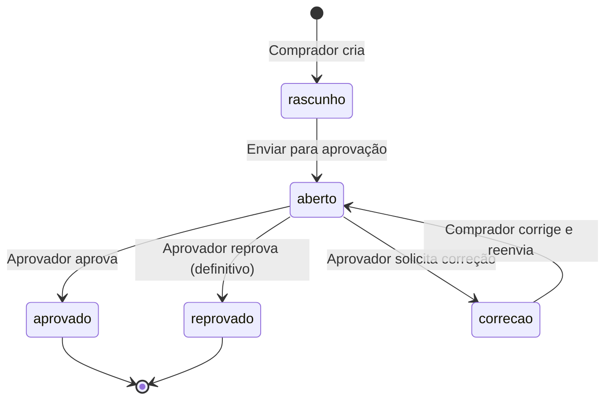
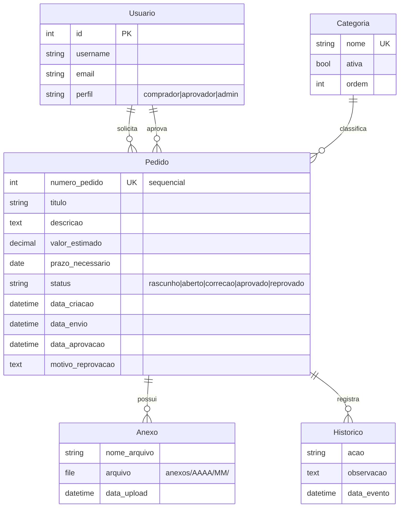

# 🛒 CompraBio — Sistema de Aprovação de Pedidos de Compra

Sistema web para **solicitação, análise e aprovação de pedidos de compra** da rede **Bio Mundo**.
Um comprador abre o pedido, um aprovador decide (aprovar, devolver para correção ou reprovar), e cada etapa
gera **histórico auditável** e **notificação por e-mail**. Inclui dashboards, exportação em PDF/Excel e
lembretes automáticos de pedidos parados.

<p align="left">
  
  
  
  
</p>

---

## 📑 Índice

- [Principais funcionalidades](#-principais-funcionalidades)
- [Perfis de acesso](#-perfis-de-acesso)
- [Fluxo do pedido](#-fluxo-do-pedido)
- [Stack técnica](#-stack-técnica)
- [Modelo de dados](#-modelo-de-dados)
- [Estrutura do projeto](#-estrutura-do-projeto)
- [Instalação e execução](#-instalação-e-execução)
- [Dados de exemplo (seed)](#-dados-de-exemplo-seed)
- [Configuração de e-mail](#-configuração-de-e-mail)
- [Lembretes automáticos](#-lembretes-automáticos-de-pedidos-parados)
- [Exportações](#-exportações)
- [Rotas](#-rotas)
- [Variáveis de ambiente](#-variáveis-de-ambiente)
- [Notas de segurança](#-notas-de-segurança)

---

## ✨ Principais funcionalidades

- **Ciclo completo de aprovação** com 5 status: rascunho → em aberto → (correção) → aprovado/reprovado.
- **Controle por perfil**: comprador, aprovador e administrador, com permissões distintas em cada view.
- **Anexos** de planilhas (`.xlsx` / `.xls`) por pedido, com upload/download/remoção controlados.
- **Histórico auditável**: toda ação (criação, envio, correção, aprovação, reprovação) fica registrada com autor e data.
- **Notificações por e-mail** em HTML para cada transição do fluxo (novo pedido, aprovado, correção, reprovado, reenviado).
- **Dashboards**: visão do usuário e visão administrativa com taxas de aprovação/reprovação e série dos últimos 6 meses.
- **Tela de controle** com filtros (data, status, solicitante, número, busca textual) e paginação.
- **Exportação em PDF** (documento individual do pedido, com histórico) e **Excel** (lista completa).
- **Lembretes automáticos** por e-mail para pedidos em aberto sem decisão há N dias (management command agendável).
- **Cadastro público** de novos usuários (entram como `comprador`; o admin ajusta o perfil).

---

## 👥 Perfis de acesso

O modelo de usuário é customizado (`core.Usuario`, herda de `AbstractUser`) com o campo `perfil`:

| Perfil          | Criar pedido | Aprovar/Reprovar | Ver todos os pedidos | Gerenciar usuários/categorias | Dashboard admin |
|-----------------|:------------:|:----------------:|:--------------------:|:-----------------------------:|:---------------:|
| **Comprador**   | ✅           | ❌               | ❌ (só os próprios)   | ❌                            | ❌              |
| **Aprovador**   | ❌           | ✅               | ✅                    | ❌                            | ❌              |
| **Administrador** | ✅         | ✅               | ✅                    | ✅                            | ✅              |

> O `admin` do seed também é `superuser`/`is_staff`, portanto acessa o Django Admin em `/admin/`.

---

## 🔄 Fluxo do pedido



**Regras de negócio principais:**
- Editáveis apenas nos status `rascunho` e `correcao`.
- Ao reenviar após correção, os campos de decisão (`aprovador`, `data_aprovacao`, `motivo`) são **zerados** e os aprovadores são notificados.
- `reprovado` é **definitivo** — o pedido não pode ser editado; abre-se um novo, se necessário.
- Cada pedido recebe um `numero_pedido` sequencial e único, gerado automaticamente.

**Quem é notificado em cada evento:**

| Evento | Destinatário | Função |
|--------|--------------|--------|
| Novo pedido enviado | Aprovadores + Admins | `notificar_novo_pedido` |
| Pedido corrigido e reenviado | Aprovadores + Admins | `notificar_pedido_reenviado` |
| Aprovado | Solicitante | `notificar_pedido_aprovado` |
| Correção solicitada | Solicitante | `notificar_correcao_solicitada` |
| Reprovado | Solicitante | `notificar_pedido_reprovado` |
| Parado há N dias | Aprovadores + Admins | command `lembrar_pedidos` |

---

## 🧱 Stack técnica

| Camada | Tecnologia |
|--------|-----------|
| Backend | Django 5.1 (Python 3.13) |
| Banco | SQLite (`db.sqlite3`) |
| Templates | Django Templates (server-side render) |
| PDF | ReportLab |
| Excel | openpyxl (escrita) / xlrd (leitura `.xls`) |
| Imagens | Pillow |
| Config/segredos | python-dotenv (`.env`) |
| E-mail | Django Email (filebased em dev · SMTP Locaweb em prod) |

**Dependências** (`requirements.txt`):
```
Django>=5.1,<5.2
python-dotenv>=1.0.0
openpyxl>=3.1.0
xlrd>=2.0.0
Pillow>=10.0.0
reportlab>=4.0.0
```

---

## 🗃️ Modelo de dados



**Apps Django:**
- **`core`** — usuário customizado, autenticação/cadastro, dashboards (usuário e admin), gestão de usuários e categorias, e o módulo de notificações por e-mail.
- **`pedidos`** — CRUD e workflow do pedido, anexos, histórico, tela de controle, exportações PDF/Excel e o comando de lembretes.

---

## 📂 Estrutura do projeto

```
aprovacao_compras/
├── config/                 # Projeto Django (settings, urls, wsgi/asgi)
│   ├── settings.py
│   └── urls.py
├── core/                   # App de autenticação, usuários, dashboards, notificações
│   ├── models.py           # Usuario (AbstractUser + perfil)
│   ├── views.py            # login, cadastro, dashboards, gestão de usuários/categorias
│   ├── notifications.py    # e-mails HTML de cada evento do fluxo
│   └── urls.py
├── pedidos/                # App do fluxo de pedidos
│   ├── models.py           # Categoria, Pedido, Anexo, Historico
│   ├── views.py            # criar/editar/enviar/aprovar/controle/exportar
│   ├── admin.py            # Django Admin (inlines de anexo e histórico)
│   ├── management/commands/
│   │   └── lembrar_pedidos.py   # lembrete de pedidos parados
│   └── migrations/         # 0001..0004
├── templates/              # base, auth, dashboards, pedidos, core
├── static/                 # logo.png
├── media/anexos/           # uploads (ignorado no git)
├── logs/emails/            # e-mails em dev (backend filebased)
├── seed.py                 # popula usuários e pedidos de exemplo
├── run.bat                 # setup + execução no Windows
├── requirements.txt
└── .env                    # segredos (ignorado no git)
```

---

## 🚀 Instalação e execução

### Opção A — Windows (script pronto)

```bat
run.bat
```

O `run.bat` faz tudo automaticamente: cria o `.venv` (se não existir), instala as dependências,
aplica as migrations, abre o navegador e sobe o servidor em `0.0.0.0:8000`.

> O script abre `http://comprabio.local:8000`. Para esse hostname funcionar, adicione a linha abaixo ao
> arquivo `C:\Windows\System32\drivers\etc\hosts` (como administrador):
> ```
> 127.0.0.1    comprabio.local
> ```
> Alternativamente, acesse direto por `http://localhost:8000` (também está em `ALLOWED_HOSTS`).

### Opção B — Manual (multiplataforma)

```bash
# 1. Ambiente virtual
python -m venv .venv
# Windows:
.venv\Scripts\activate
# Linux/Mac:
source .venv/bin/activate

# 2. Dependências
pip install -r requirements.txt

# 3. Banco de dados
python manage.py migrate

# 4. (Opcional) dados de exemplo
python seed.py
# ou crie um superusuário:
python manage.py createsuperuser

# 5. Rodar
python manage.py runserver 0.0.0.0:8000
```

Acesse **http://localhost:8000** · admin do Django em **http://localhost:8000/admin/**.

---

## 🌱 Dados de exemplo (seed)

`python seed.py` cria usuários e pedidos de demonstração:

| Usuário | Senha    | Perfil                        |
|---------|----------|-------------------------------|
| `admin` | `admin123` | Administrador (+ superuser) |
| `lucas` | `lucas123` | Aprovador                   |
| `ana`   | `ana123`   | Compradora                  |
| `joao`  | `joao123`  | Comprador                   |

> ⚠️ Credenciais de demonstração — **troque antes de qualquer uso real**.

---

## 📧 Configuração de e-mail

Por padrão o sistema usa o backend **filebased**: os e-mails **não são enviados**, mas gravados em
`logs/emails/` — ótimo para desenvolvimento e testes.

Para enviar de verdade (SMTP Locaweb), configure o `.env`:

```env
EMAIL_BACKEND=django.core.mail.backends.smtp.EmailBackend
EMAIL_HOST=smtplw.com.br
EMAIL_PORT=587
EMAIL_HOST_USER=seu_usuario
EMAIL_HOST_PASSWORD=sua_senha
EMAIL_USE_TLS=True
EMAIL_USE_SSL=False
EMAIL_FROM=CompraBio <comprabio@biomundo.com.br>
SITE_URL=http://comprabio.local:8000
```

`SITE_URL` é usada para montar os links dos botões dentro dos e-mails.

---

## ⏰ Lembretes automáticos de pedidos parados

Envia e-mail aos aprovadores para pedidos **em aberto** sem decisão há mais de N dias:

```bash
# Padrão: 2 dias
python manage.py lembrar_pedidos

# Personalizado
python manage.py lembrar_pedidos --dias 3
```

**Agendamento (Windows — Agendador de Tarefas):** crie uma tarefa diária executando
`.venv\Scripts\python.exe manage.py lembrar_pedidos` no diretório do projeto.
No Linux, use um `cron` equivalente.

---

## 📤 Exportações

- **PDF individual** — `pedidos/<id>/exportar-pdf/`: documento completo do pedido gerado com ReportLab,
  incluindo dados, motivo (quando houver) e histórico cronológico.
- **Excel (lista)** — `pedidos/exportar-excel/`: planilha de todos os pedidos (compradores exportam
  apenas os próprios), com número, datas, solicitante, status, aprovador e motivo.

---

## 🗺️ Rotas

**core**
| Rota | Nome | Descrição |
|------|------|-----------|
| `/` | `dashboard` | Painel do usuário (com filtros) |
| `/login/` · `/logout/` | `login` · `logout` | Autenticação |
| `/cadastro/` | `registro` | Cadastro público (entra como comprador) |
| `/admin-dashboard/` | `admin_dashboard` | Painel administrativo com KPIs |
| `/usuarios/` | `gerenciar_usuarios` | Gestão de usuários (admin) |
| `/configuracoes/categorias/` | `gerenciar_categorias` | Gestão de categorias (admin) |

**pedidos** (prefixo `/pedidos/`)
| Rota | Nome | Descrição |
|------|------|-----------|
| `novo/` | `criar_pedido` | Criar pedido (rascunho ou já enviar) |
| `<id>/` | `detalhe_pedido` | Detalhe do pedido |
| `<id>/editar/` | `editar_pedido` | Editar (rascunho/correção) |
| `<id>/enviar/` | `enviar_pedido` | Enviar rascunho para aprovação |
| `<id>/aprovar/` | `aprovar_pedido` | Decisão do aprovador |
| `<id>/anexo/<anexo_id>/download/` | `download_anexo` | Baixar anexo |
| `<id>/anexo/<anexo_id>/remover/` | `remover_anexo` | Remover anexo |
| `controle/` | `controle_processos` | Lista com filtros e paginação |
| `<id>/exportar-pdf/` | `exportar_pdf` | PDF do pedido |
| `exportar-excel/` | `exportar_excel` | Excel da lista |

---

## 🔐 Variáveis de ambiente

| Variável | Padrão | Descrição |
|----------|--------|-----------|
| `SECRET_KEY` | *(chave insegura embutida)* | Chave secreta do Django |
| `DEBUG` | `True` | Modo debug |
| `SITE_URL` | `http://127.0.0.1:8000` | Base para links nos e-mails |
| `EMAIL_BACKEND` | `...filebased.EmailBackend` | Backend de e-mail |
| `EMAIL_HOST` / `EMAIL_PORT` | `smtplw.com.br` / `587` | Servidor SMTP |
| `EMAIL_HOST_USER` / `EMAIL_HOST_PASSWORD` | *(vazio)* | Credenciais SMTP |
| `EMAIL_USE_TLS` / `EMAIL_USE_SSL` | `True` / `False` | Segurança da conexão |
| `EMAIL_FROM` | `CompraBio <comprabio@biomundo.com.br>` | Remetente |

---

## ⚠️ Notas de segurança

Este projeto está configurado para **uso interno/desenvolvimento**. Antes de expor em rede ou produção:

- [ ] Definir `SECRET_KEY` via `.env` (a padrão embutida é pública e insegura).
- [ ] `DEBUG=False` e revisar `ALLOWED_HOSTS`.
- [ ] Trocar todas as senhas de demonstração do seed.
- [ ] Migrar de SQLite para PostgreSQL/SQL Server em caso de acesso concorrente.
- [ ] Servir estáticos/mídia por servidor dedicado (nginx/WhiteNoise) e não pelo Django em `DEBUG`.
- [ ] Considerar antivírus/validação mais rígida nos uploads (hoje restrito a `.xlsx`/`.xls`).

---

<p align="center">
  <strong>CompraBio</strong> · Bio Mundo · Aprovação de Pedidos de Compra
</p>
```
