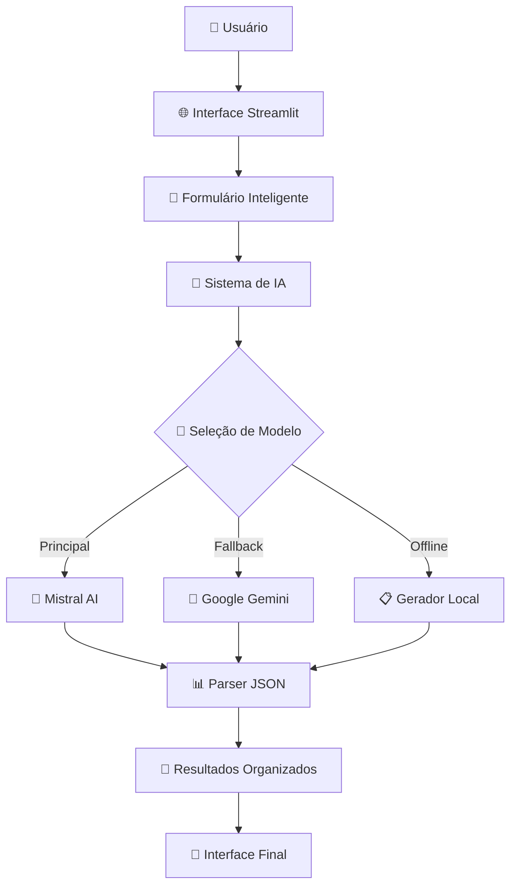

<div align="center">

# 🗺️ Gerador de Roteiros de Viagem com IA

<p align="center">
  
</p>

<h3 align="center">✨ <em>Transforme seus sonhos de viagem em roteiros perfeitos</em> ✨</h3>
<p align="center"><strong>Powered by Mistral AI & Google Gemini</strong></p>

<p align="center">
  
  
  
  
  
</p>

<p align="center">
  <a href="#-início-rápido">
    
  </a>
  <a href="#-exemplos">
    
  </a>
  <a href="#-deploy">
    
  </a>
</p>

---

<table>
<tr>
<td align="center" width="25%">
  <br>
  <strong>IA Dupla</strong><br>
  <small>Mistral + Gemini</small>
</td>
<td align="center" width="25%">
  <br>
  <strong>Interface Moderna</strong><br>
  <small>Design Responsivo</small>
</td>
<td align="center" width="25%">
  <br>
  <strong>Vida Noturna</strong><br>
  <small>Bares & Eventos</small>
</td>
<td align="center" width="25%">
  <br>
  <strong>Sistema Robusto</strong><br>
  <small>Fallback Inteligente</small>
</td>
</tr>
</table>

</div>

## 🚀 Início Rápido

<table>
<tr>
<td width="33%" align="center">

### 📥 **1. Instalar**
```bash
git clone [repo-url]
cd gerador_roteiros
python setup.py
```
<sub>Setup automático completo</sub>

</td>
<td width="33%" align="center">

### 🔑 **2. Configurar**
```bash
# Edite .streamlit/secrets.toml
MISTRAL_API_KEY = "sua_chave"
GEMINI_API_KEY = "sua_chave"
```
<sub>APIs Mistral + Gemini</sub>

</td>
<td width="33%" align="center">

### 🎯 **3. Executar**
```bash
streamlit run app.py
# Acesse: localhost:8501
```
<sub>Interface web moderna</sub>

</td>
</tr>
</table>

> 💡 **Novo usuário?** Siga o [**Guia Completo**](#-guia-completo) • **Desenvolvedor?** Veja a [**Documentação**](#-documentação)

---

## ✨ Funcionalidades

<div align="center">

### 🎯 **O que torna este projeto especial?**

</div>

<table>
<tr>
<td width="50%">

#### 🤖 **Inteligência Artificial Avançada**
- **Mistral AI** como modelo principal
- **Google Gemini** como fallback automático
- **Sistema offline** para máxima confiabilidade
- **Prompts otimizados** para resultados precisos

#### 📱 **Interface Moderna**
- **Design responsivo** para todos os dispositivos
- **Modo escuro** automático
- **Navegação intuitiva** em abas organizadas
- **CSS customizado** para experiência premium

</td>
<td width="50%">

#### 🎯 **Personalização Completa**
- **Perfil detalhado** do viajante
- **Seleção flexível** de datas
- **Interesses específicos** e restrições
- **Orçamento e ritmo** personalizáveis

#### 🌃 **Recursos Únicos**
- **Vida noturna especializada** (bares, festas, eventos)
- **Gastronomia local** com restaurantes secretos
- **Cronograma detalhado** hora por hora
- **Dicas práticas** de especialistas

</td>
</tr>
</table>

## 🏗️ Arquitetura

<div align="center">



</div>

### 🔄 **Fluxo de Funcionamento**

<table>
<tr>
<td width="20%" align="center">
  <br>
  <strong>1. Entrada</strong><br>
  <small>Formulário detalhado</small>
</td>
<td width="20%" align="center">
  <br>
  <strong>2. Processamento</strong><br>
  <small>Validação e formatação</small>
</td>
<td width="20%" align="center">
  <br>
  <strong>3. IA</strong><br>
  <small>Geração inteligente</small>
</td>
<td width="20%" align="center">
  <br>
  <strong>4. Parsing</strong><br>
  <small>Estruturação JSON</small>
</td>
<td width="20%" align="center">
  <br>
  <strong>5. Apresentação</strong><br>
  <small>Interface organizada</small>
</td>
</tr>
</table>

## 🛠️ Stack Tecnológico

<div align="center">

### 🎯 **Tecnologias de Ponta para Máxima Performance**

</div>

<table>
<tr>
<td width="33%" align="center">

#### 🐍 **Backend**


</td>
<td width="33%" align="center">

#### 🤖 **Inteligência Artificial**


</td>
<td width="33%" align="center">

#### 🎨 **Frontend & Deploy**


</td>
</tr>
</table>

---

## 📁 Estrutura do Projeto

<div align="center">

### 🗂️ **Organização Profissional e Modular**

</div>

<table>
<tr>
<td width="50%">

#### 🎯 **Core da Aplicação**
```
📄 app.py              # Interface principal (661 linhas)
📁 pages/
  └── 01_Roteiro.py     # Resultados organizados
📁 utils/
  ├── __init__.py       # Pacote Python
  └── prompts.py        # Sistema de IA
```

#### ⚙️ **Configuração & Deploy**
```
📄 setup.py            # ⭐ Setup automático
📄 settings.json       # ⭐ Configurações
📄 examples.py         # ⭐ Demonstrações
📄 requirements.txt    # Dependências
📄 Dockerfile          # Container
📄 docker-compose.yml  # Orquestração
```

</td>
<td width="50%">

#### 🔧 **Desenvolvimento**
```
📄 .gitignore          # Exclusões Git
📄 .pre-commit-config  # Qualidade código
📁 .github/workflows/  # CI/CD automático
📁 .streamlit/         # Config Streamlit
  ├── secrets.toml     # 🔐 Chaves API
  └── config.toml      # Configurações
```

#### 📚 **Documentação & Logs**
```
📄 README.md           # Documentação completa
📄 LICENSE             # Licença MIT
📁 logs/               # Sistema de logs
  ├── app.log          # Log geral
  └── error.log        # Log de erros
```

</td>
</tr>
</table>

> 💡 **Arquivos destacados com ⭐ são novidades que facilitam setup e uso**

### 📋 Descrição dos Arquivos

#### 🎯 Arquivos Principais

- **`app.py`**: Aplicação principal com interface e lógica de negócio
- **`pages/01_Roteiro.py`**: Página de visualização dos resultados
- **`utils/prompts.py`**: Sistema de prompts e formatação de dados

#### ⚙️ Arquivos de Configuração

- **`requirements.txt`**: Dependências Python necessárias
- **`settings.json`**: ⭐ **NOVO** - Configurações centralizadas do projeto
- **`setup.py`**: ⭐ **NOVO** - Script de configuração automática
- **`examples.py`**: ⭐ **NOVO** - Exemplos de uso e demonstrações
- **`.streamlit/secrets.toml`**: Chaves de API (configurar localmente)
- **`logs/`**: Diretório para arquivos de log

---

## ⚡ Instalação Automática

### 🚀 **Método Recomendado - Setup Automático**

```bash
# 1. Clone o repositório
git clone https://github.com/seu-usuario/gerador-roteiros.git
cd gerador_roteiros

# 2. Execute o script de configuração automática
python setup.py
```

**🎉 Pronto! O script `setup.py` fará automaticamente:**
- ✅ Verificação da versão do Python (3.8+)
- ✅ Criação de diretórios necessários
- ✅ Instalação de dependências
- ✅ Configuração de arquivos de exemplo
- ✅ Criação do `.gitignore` e `settings.json`

### 📋 **Pré-requisitos**

- **Python 3.8+** instalado
- **Git** para clonagem do repositório
- **Chaves de API** para Mistral AI e/ou Google Gemini

### 🔧 **Instalação Manual (Alternativa)**

<details>
<summary><strong>Clique para ver instalação manual</strong></summary>

```bash
# 1. Clone o repositório
git clone https://github.com/seu-usuario/gerador-roteiros.git
cd gerador_roteiros

# 2. Crie o ambiente virtual
python -m venv venv

# 3. Ative o ambiente virtual
# Windows:
venv\Scripts\activate
# Linux/Mac:
source venv/bin/activate

# 4. Instale as dependências
pip install -r requirements.txt

# 5. Configure as chaves de API
cp .streamlit/secrets.toml.example .streamlit/secrets.toml
# Edite o arquivo com suas chaves

# 6. Execute a aplicação
streamlit run app.py
```

</details>

### 🔑 Configuração das Chaves de API

<table>
<tr>
<td width="50%">

#### 🔮 **Mistral AI** (Principal)
1. Acesse [console.mistral.ai](https://console.mistral.ai)
2. Crie uma conta gratuita
3. Gere uma API key
4. Adicione no arquivo `secrets.toml`

</td>
<td width="50%">

#### 💎 **Google Gemini** (Fallback)
1. Acesse [makersuite.google.com](https://makersuite.google.com)
2. Crie um projeto Google Cloud
3. Gere uma API key
4. Adicione no arquivo `secrets.toml`

</td>
</tr>
</table>

### 📝 Exemplo de `secrets.toml`

```toml
# 🔐 Chaves de API - NUNCA commite este arquivo com chaves reais

# Mistral AI (obrigatória)
MISTRAL_API_KEY = "sua_chave_mistral_aqui"

# Google Gemini (opcional, usado como fallback)
GEMINI_API_KEY = "sua_chave_gemini_aqui"

# Configurações opcionais
# DEBUG = false
# LOG_LEVEL = "INFO"
```

> 💡 **Dica**: O arquivo `secrets.toml` é criado automaticamente pelo `setup.py`

---

## 🎯 Como Usar

### 🚀 **Início Rápido**

```bash
# Após a instalação, execute:
streamlit run app.py
```

**🌐 Acesse:** `http://localhost:8501`

### 🎯 **Passo a Passo Detalhado**

#### 1. **🚀 Inicie a Aplicação**
```bash
streamlit run app.py
```
- Interface moderna será carregada no navegador
- Sistema verificará automaticamente as APIs disponíveis

#### 2. **🤖 Configure a IA**
- **Mistral AI**: Modelo principal (recomendado)
- **Google Gemini**: Fallback automático
- Seleção de modelo específico do Gemini

#### 3. **📝 Preencha o Formulário Inteligente**

<table>
<tr>
<td width="50%">

**📍 Informações Básicas**
- Destino principal
- Tipo de data (específica/mês/IA escolhe)
- Duração da viagem

**👥 Perfil dos Viajantes**
- Tipo de viagem (casal, família, etc.)
- Número de viajantes
- Faixa etária
- Presença de crianças

</td>
<td width="50%">

**🎯 Preferências**
- Orçamento (econômico/luxo)
- Ritmo (relaxado/intenso)
- Interesses específicos
- Nível de caminhada

**📝 Detalhes Adicionais**
- Restrições alimentares
- Horários preferidos
- Aversões
- Observações especiais

</td>
</tr>
</table>

#### 4. **Gere o Roteiro**
- Clique em "✨ Gerar Roteiro Personalizado"
- Aguarde o processamento da IA
- Visualize os resultados organizados

#### 5. **🎨 Explore os Resultados**

<table>
<tr>
<td width="20%" align="center">
  <br>
  **📋 Visão Geral**<br>
  <small>Informações essenciais</small>
</td>
<td width="20%" align="center">
  <br>
  **📅 Cronograma**<br>
  <small>Dia a dia detalhado</small>
</td>
<td width="20%" align="center">
  <br>
  **🍽️ Gastronomia**<br>
  <small>Pratos e restaurantes</small>
</td>
<td width="20%" align="center">
  <br>
  **🌃 Vida Noturna**<br>
  <small>Bares e eventos</small>
</td>
<td width="20%" align="center">
  <br>
  **💡 Dicas**<br>
  <small>Informações práticas</small>
</td>
</tr>
</table>

---

## 🎪 Exemplos de Uso

### 🚀 **Execute Exemplos Prontos**

O arquivo `examples.py` contém demonstrações completas para diferentes tipos de viagem:

```bash
# Execute os exemplos interativos
python examples.py
```

<table>
<tr>
<td width="50%">

#### 💕 **Viagem Romântica**
- **Destino**: Paris, França
- **Duração**: 5 dias
- **Foco**: Experiências íntimas e gastronômicas
- **Orçamento**: Luxo

#### 👨‍👩‍👧‍👦 **Viagem em Família**
- **Destino**: Orlando, EUA
- **Duração**: 7 dias
- **Foco**: Diversão para todas as idades
- **Orçamento**: Médio

</td>
<td width="50%">

#### 🏔️ **Aventura**
- **Destino**: Patagônia, Chile
- **Duração**: 10 dias
- **Foco**: Trilhas e natureza
- **Orçamento**: Econômico

#### 💼 **Negócios**
- **Destino**: São Paulo, Brasil
- **Duração**: 3 dias
- **Foco**: Reuniões e networking
- **Orçamento**: Corporativo

</td>
</tr>
</table>

### 🎯 **Personalize os Exemplos**

```python
# Modifique os exemplos em examples.py
exemplo_personalizado = {
    "destino": "Seu destino",
    "duracao": "Sua duração",
    "tipo_viagem": "Seu tipo",
    # ... outras configurações
}
```

---

## 🐳 Deploy com Docker

### 🚀 **Método Rápido**

```bash
# Clone e execute com Docker Compose
git clone [repo-url]
cd gerador_roteiros
docker-compose up -d
```

**🌐 Acesse:** `http://localhost:8501`

### 🔧 **Build Manual**

```bash
# Build da imagem
docker build -t gerador-roteiros .

# Execute o container
docker run -p 8501:8501 \
  -e MISTRAL_API_KEY="sua_chave" \
  -e GEMINI_API_KEY="sua_chave" \
  gerador-roteiros
```

### ⚙️ **Configuração Avançada**

```yaml
# docker-compose.yml personalizado
version: '3.8'
services:
  app:
    build: .
    ports:
      - "8501:8501"
    environment:
      - MISTRAL_API_KEY=${MISTRAL_API_KEY}
      - GEMINI_API_KEY=${GEMINI_API_KEY}
    volumes:
      - ./logs:/app/logs
```

---

## 🔧 Configuração Avançada

### ⚙️ **Arquivo `settings.json`**

O projeto inclui um sistema de configuração centralizado:

```json
{
  "app": {
    "name": "Gerador de Roteiros de Viagem com IA",
    "version": "2.0.0",
    "debug": false
  },
  "ai_providers": {
    "mistral": {
      "enabled": true,
      "model": "mistral-large-latest"
    },
    "gemini": {
      "enabled": true,
      "models": ["gemini-2.0-flash-exp", "gemini-1.5-pro"]
    }
  }
}
```

### 🎨 **Personalização da Interface**

- **Cores**: Modifique o CSS em `app.py`
- **Layout**: Ajuste componentes Streamlit
- **Idioma**: Traduza textos nos arquivos Python

### 📊 **Monitoramento e Logs**

```python
# Sistema de logging configurável
import loguru

# Logs automáticos em logs/app.log
logger.info("Aplicação iniciada")
logger.error("Erro na API")
```

---

## 🤝 Contribuição

### 🎯 **Como Contribuir**

1. **Fork** o repositório
2. **Clone** sua fork localmente
3. **Crie** uma branch para sua feature
4. **Desenvolva** e teste suas mudanças
5. **Envie** um Pull Request

### 📋 **Diretrizes**

- Siga o padrão de código existente
- Adicione testes para novas funcionalidades
- Atualize a documentação quando necessário
- Use commits descritivos

### 🐛 **Reportar Bugs**

Abra uma [issue](https://github.com/seu-usuario/gerador-roteiros/issues) com:
- Descrição detalhada do problema
- Passos para reproduzir
- Ambiente (OS, Python, etc.)
- Screenshots se aplicável

---

## 📄 Licença

Este projeto está licenciado sob a **Licença MIT** - veja o arquivo [LICENSE](LICENSE) para detalhes.

---

## 🙏 Agradecimentos

### 🤖 **Tecnologias Utilizadas**
- [Streamlit](https://streamlit.io/) - Framework web incrível
- [Mistral AI](https://mistral.ai/) - IA de alta qualidade
- [Google Gemini](https://deepmind.google/technologies/gemini/) - IA versátil
- [Python](https://python.org/) - Linguagem poderosa

### 🌟 **Inspirações**
- Comunidade open source
- Desenvolvedores que compartilham conhecimento
- Viajantes que buscam experiências únicas

---

<div align="center">

## ⭐ Apoie o Projeto

Se este projeto foi útil para você, considere dar uma ⭐ no repositório!

[](https://github.com/seu-usuario/gerador-roteiros/stargazers)
[](https://github.com/seu-usuario/gerador-roteiros/network)

**Desenvolvido com ❤️ para a comunidade de viajantes**

---

*© 2024 - Gerador de Roteiros de Viagem com IA*

</div>

</td>
<td width="20%" align="center">

**🗓️ Cronograma**  
*Atividades dia a dia*

</td>
<td width="20%" align="center">

**🍽️ Gastronomia**  
*Pratos e restaurantes*

</td>
<td width="20%" align="center">

**🌃 Vida Noturna**  
*Bares e eventos*

</td>
<td width="20%" align="center">

**💡 Dicas**  
*Informações práticas*

</td>
</tr>
</table>

### 🎪 Interface de Resultados

A página de resultados é organizada em **abas intuitivas** com:
- 🎨 **Design responsivo** e moderno
- 🌙 **Modo escuro** automático
- 📱 **Adaptação mobile** perfeita
- ⚡ **Navegação fluida** entre seções

---

## 🎪 Exemplos de Uso

### 🎯 **Demonstrações Interativas**

O arquivo `examples.py` contém exemplos prontos para testar:

```bash
# Execute os exemplos
python examples.py
```

**📋 Exemplos Inclusos:**
- 💕 **Viagem Romântica**: Paris para casal
- 👨‍👩‍👧‍👦 **Viagem em Família**: Orlando com crianças
- 🏔️ **Viagem de Aventura**: Nepal para grupo
- 💼 **Viagem de Negócios**: São Paulo executivo

### 🎨 **Personalize seus Exemplos**

```python
# Exemplo de dados personalizados
from examples import exemplo_viagem_romantica
from utils.prompts import format_user_prompt_viagem

# Carregue um exemplo
dados = exemplo_viagem_romantica()

# Modifique conforme necessário
dados['destino'] = 'Santorini, Grécia'
dados['duracao'] = 10

# Gere o prompt
prompt = format_user_prompt_viagem(dados)
print(prompt)
```

---

## 🐳 Deploy com Docker

### 🚀 **Deploy Rápido**

```bash
# Usando Docker Compose (recomendado)
docker-compose up -d

# Ou usando Docker diretamente
docker build -t gerador-roteiros .
docker run -p 8501:8501 gerador-roteiros
```

### ⚙️ **Configuração Docker**

```yaml
# docker-compose.yml
version: '3.8'
services:
  app:
    build: .
    ports:
      - "8501:8501"
    environment:
      - MISTRAL_API_KEY=${MISTRAL_API_KEY}
      - GEMINI_API_KEY=${GEMINI_API_KEY}
    volumes:
      - ./logs:/app/logs
```

---

## 🔧 Configuração Avançada

### ⚙️ **Arquivo `settings.json`**

O projeto inclui um sistema de configuração centralizado:

```json
{
  "ai_providers": {
    "default_provider": "mistral",
    "mistral": {
      "model": "mistral-large-latest",
      "temperature": 0.7
    },
    "gemini": {
      "default_model": "gemini-2.5-flash",
      "temperature": 0.7
    }
  },
  "features": {
    "vida_noturna": true,
    "gastronomia": true,
    "export_pdf": false
  }
}
```

### 🎨 **Configurações Avançadas**

#### 🎨 Personalização da Interface

O arquivo `app.py` contém configurações CSS customizáveis:

```python
# Cores principais
--primary-color: #667eea
--secondary-color: #764ba2
--background-color: #f0f2f6

# Modo escuro
[data-theme="dark"] {
    --background-color: #1e1e1e
    --card-background: #2d2d2d
}
```

#### 🤖 Configuração de Modelos

```python
# Modelos disponíveis
MISTRAL_MODELS = ["mistral-large-latest"]
GEMINI_MODELS = ["gemini-2.5-flash", "gemini-2.0-pro", "gemini-1.5-pro-latest"]
```

#### 📊 Sistema de Logging

```python
# Configuração de logs
logger.add("logs/app.log", rotation="1 day", retention="7 days", level="INFO")
logger.add("logs/error.log", rotation="1 day", retention="30 days", level="ERROR")
```

### 🔄 Fallback e Recuperação

O sistema possui múltiplas camadas de fallback:

1. **Modelo Principal** → Mistral AI
2. **Modelo Secundário** → Google Gemini
3. **Fallback Offline** → Gerador local

---

## 📊 API Reference

### 🤖 Funções de IA

#### `_call_mistral(user_prompt: str) -> Optional[str]`

Chama a API do Mistral AI para gerar roteiros.

**Parâmetros:**
- `user_prompt`: Prompt formatado com dados do usuário

**Retorna:**
- `str`: Resposta da IA em formato JSON
- `None`: Em caso de erro

#### `_call_gemini(user_prompt: str, model_name: str) -> Optional[str]`

Chama a API do Google Gemini para gerar roteiros.

**Parâmetros:**
- `user_prompt`: Prompt formatado com dados do usuário
- `model_name`: Nome do modelo Gemini a usar

**Retorna:**
- `str`: Resposta da IA em formato JSON
- `None`: Em caso de erro

#### `_parse_json_response(text: str) -> Optional[Dict]`

Converte resposta da IA em estrutura JSON válida.

**Parâmetros:**
- `text`: Texto bruto da resposta da IA

**Retorna:**
- `Dict`: Estrutura JSON parseada
- `None`: Em caso de erro de parsing

### 📝 Funções de Formatação

#### `format_user_prompt_viagem(data: dict) -> str`

Formata dados do usuário em prompt estruturado.

**Parâmetros:**
- `data`: Dicionário com dados do formulário

**Retorna:**
- `str`: Prompt formatado para a IA

---

## 🎨 Personalização

### 🎯 Modificando Prompts

Edite o arquivo `utils/prompts.py` para personalizar:

- **Persona da IA**: Comportamento e tom de voz
- **Estrutura de Resposta**: Formato do JSON de saída
- **Instruções Específicas**: Diretrizes para diferentes tipos de viagem

### 🎨 Customizando Interface

Modifique as variáveis CSS em `app.py`:

```python
# Cores personalizadas
:root {
    --primary-color: #sua_cor_primaria;
    --secondary-color: #sua_cor_secundaria;
}
```

### 🔧 Adicionando Novos Modelos

1. Implemente função de chamada no `app.py`
2. Adicione opção na interface
3. Integre no sistema de fallback

---

## 🐛 Troubleshooting

### ❌ Problemas Comuns

#### **Erro: "Chave API não encontrada"**
```
Solução: Verifique se o arquivo .streamlit/secrets.toml está configurado corretamente
```

#### **Erro: "Módulo não encontrado"**
```
Solução: Ative o ambiente virtual e instale as dependências
pip install -r requirements.txt
```

#### **Erro: "Porta já em uso"**
```
Solução: Use uma porta diferente
streamlit run app.py --server.port 8502
```

#### **Interface não atualiza**
```
Solução: Limpe o cache do navegador ou reinicie a aplicação
```

### 📊 Logs e Debugging

- **Logs gerais**: `logs/app.log`
- **Logs de erro**: `logs/error.log`
- **Debug no terminal**: Execute com `--logger.level debug`

### 🔍 Verificação de Saúde

```bash
# Verificar dependências
pip check

# Verificar logs
tail -f logs/app.log

# Testar APIs
python -c "import requests; print('APIs OK')"
```

---

## 🤝 Contribuição

### 🚀 Como Contribuir

1. **Fork** o repositório
2. **Crie** uma branch para sua feature (`git checkout -b feature/nova-funcionalidade`)
3. **Commit** suas mudanças (`git commit -m 'Adiciona nova funcionalidade'`)
4. **Push** para a branch (`git push origin feature/nova-funcionalidade`)
5. **Abra** um Pull Request

### 📋 Guidelines

- **Código**: Siga PEP 8 e boas práticas Python
- **Commits**: Use mensagens descritivas
- **Testes**: Adicione testes para novas funcionalidades
- **Documentação**: Atualize README quando necessário

### 🐛 Reportando Bugs

Use o sistema de Issues do GitHub com:

- **Título** descritivo
- **Descrição** detalhada do problema
- **Passos** para reproduzir
- **Logs** relevantes
- **Screenshots** se aplicável

---

## 📄 Licença

Este projeto está licenciado sob a **MIT License** - veja o arquivo [LICENSE](LICENSE) para detalhes.

### 📜 Resumo da Licença

- ✅ **Uso comercial** permitido
- ✅ **Modificação** permitida
- ✅ **Distribuição** permitida
- ✅ **Uso privado** permitido
- ❌ **Responsabilidade** não garantida

---

## ⭐ Apoie o Projeto

<div align="center">

### 🌟 **Se este projeto foi útil, considere apoiar!** 🌟

[](https://github.com/seu-usuario/gerador-roteiros)
[](https://github.com/seu-usuario/gerador-roteiros)
[](https://github.com/seu-usuario/gerador-roteiros)

**💡 Formas de Apoiar:**
- ⭐ Dê uma estrela no GitHub
- 🐛 Reporte bugs e sugestões
- 🤝 Contribua com código
- 📢 Compartilhe com amigos
- 💬 Deixe feedback

</div>

---

## 🙏 Agradecimentos

<table>
<tr>
<td width="25%" align="center">

**🚀 Streamlit**  
*Framework incrível*

</td>
<td width="25%" align="center">

**🔮 Mistral AI**  
*IA de qualidade*

</td>
<td width="25%" align="center">

**💎 Google Gemini**  
*Fallback confiável*

</td>
<td width="25%" align="center">

**🐍 Python Community**  
*Suporte contínuo*

</td>
</tr>
</table>

---

<div align="center">

### 🎯 **Desenvolvido com ❤️ para a comunidade de viajantes** 🎯

**🌍 Explore o mundo com inteligência artificial! 🌍**

---

*📅 Última atualização: Setembro 2025*  
*🏷️ Versão: 1.0.0*  
*📄 Licença: MIT*

**[⬆️ Voltar ao topo](#-gerador-de-roteiros-de-viagem-com-ia)**

</div>
