<div align="center">

# 🗺️ Gerador de Roteiros de Viagem com IA

💡 **Quer apenas testar?** Acesse a demo online: [Gerador de Roteiros · Streamlit](https://gerador-roteiros-viagem.streamlit.app)

<p align="center">
  
</p>

<h3 align="center">✨ <em>Planeje viagens inesquecíveis com roteiros detalhados e personalizados</em> ✨</h3>
<p align="center"><strong>Alimentado por IA Avançada (Mistral AI & Google Gemini) - Versão 2025</strong></p>

<p align="center">
  
  
  
  
  
</p>

<p align="center">
  <a href="#-início-rápido">
    
  </a>
  <a href="#-funcionalidades">
    
  </a>
  <a href="#-deploy-com-docker">
    
  </a>
  <a href="#-melhorias-recentes">
    
  </a>
</p>

---

<table>
<tr>
<td align="center" width="25%">
  <br>
  <strong>IA Dupla</strong><br>
  <small>Mistral + Gemini</small>
</td>
<td align="center" width="25%">
  <br>
  <strong>Interface Moderna</strong><br>
  <small>Design Responsivo</small>
</td>
<td align="center" width="25%">
  <br>
  <strong>Vida Noturna</strong><br>
  <small>Bares & Eventos</small>
</td>
<td align="center" width="25%">
  <br>
  <strong>Sistema Robusto</strong><br>
  <small>Fallback Inteligente</small>
</td>
</tr>
</table>

</div>

## ✨ Melhorias Recentes (Set/2025)

- **Respostas Mais Detalhadas**: Agora com descrições mais ricas e informações aprofundadas sobre cada destino
- **Experiência Aprimorada**: Interface mais limpa sem o menu lateral padrão do Streamlit
- **Porta Padrão Atualizada**: Agora rodando na porta 8508 para evitar conflitos
- **Otimização de Container**: Melhorias no Dockerfile para builds mais rápidos
- **Segurança Reforçada**: Execução como usuário não-root no container

## 🚀 Início Rápido

<table>
<tr>
<td width="33%" align="center">

### 📥 **1. Instalar**
```bash
git clone [repo-url]
cd gerador_roteiros
python setup.py
```
<sub>Setup automático completo</sub>

</td>
<td width="33%" align="center">

### 🔑 **2. Configurar**
1. Execute o aplicativo
2. No painel lateral, clique em "🔑 Configurar Chave Mistral"
3. Insira sua chave da API Mistral
4. Repita para a chave da API Gemini, se necessário

<sub>APIs Mistral + Gemini</sub>

</td>
<td width="33%" align="center">

### 🎯 **3. Executar**
```bash
streamlit run app.py
# Acesse: localhost:8501
```
<sub>Interface web moderna</sub>

</td>
</tr>
</table>

> 💡 **Novo usuário?** Siga o [**Guia Completo**](#-guia-de-instalação-completo) • **Desenvolvedor?** Veja a [**Documentação**](#-documentação-técnica)

---

## ✨ Funcionalidades

<div align="center">

### 🎯 **O que torna este projeto especial?**

</div>

<table>
<tr>
<td width="50%">

#### 🤖 **Inteligência Artificial Avançada**
- **Mistral AI** como modelo principal
- **Google Gemini** como fallback automático
- **Sistema offline** para máxima confiabilidade
- **Prompts otimizados** para resultados precisos

#### 📱 **Interface Moderna**
- **Design responsivo** para todos os dispositivos
- **Modo escuro** automático
- **Navegação intuitiva** em abas organizadas
- **CSS customizado** para experiência premium

</td>
<td width="50%">

#### 🎯 **Personalização Completa**
- **Perfil detalhado** do viajante
- **Seleção flexível** de datas
- **Interesses específicos** e restrições
- **Orçamento e ritmo** personalizáveis

#### 🌃 **Recursos Únicos**
- **Vida noturna especializada** (bares, festas, eventos)
- **Gastronomia local** com restaurantes secretos
- **Cronograma detalhado** hora por hora
- **Dicas práticas** de especialistas

</td>
</tr>
</table>

## 🏗️ Arquitetura

```mermaid
graph TB
    A[👤 Usuário] --> B[🌐 Interface Streamlit]
    B --> C[📝 Formulário Inteligente]
    C --> D[🧠 Sistema de IA]
    
    D --> E{🤖 Seleção de Modelo}
    E -->|Principal| F[🔮 Mistral AI]
    E -->|Fallback| G[💎 Google Gemini]
    E -->|Offline| H[📋 Gerador Local]
    
    F --> I[📊 Parser JSON]
    G --> I
    H --> I
    
    I --> J[🎨 Resultados Organizados]
    J --> K[📱 Interface Final]
```

<div align="center">



</div>

### 🔄 **Fluxo de Funcionamento**

<table>
<tr>
<td width="20%" align="center">
  <br>
  <strong>1. Entrada</strong><br>
  <small>Formulário detalhado</small>
</td>
<td width="20%" align="center">
  <br>
  <strong>2. Processamento</strong><br>
  <small>Validação e formatação</small>
</td>
<td width="20%" align="center">
  <br>
  <strong>3. IA</strong><br>
  <small>Geração inteligente</small>
</td>
<td width="20%" align="center">
  <br>
  <strong>4. Parsing</strong><br>
  <small>Estruturação JSON</small>
</td>
<td width="20%" align="center">
  <br>
  <strong>5. Apresentação</strong><br>
  <small>Interface organizada</small>
</td>
</tr>
</table>

## 🛠️ Stack Tecnológico

<div align="center">

### 🎯 **Tecnologias de Ponta para Máxima Performance**

</div>

<table>
<tr>
<td width="33%" align="center">

#### 🐍 **Backend**


</td>
<td width="33%" align="center">

#### 🤖 **Inteligência Artificial**


</td>
<td width="33%" align="center">

#### 🎨 **Frontend & Deploy**


</td>
</tr>
</table>

---

## 📁 Estrutura do Projeto

<div align="center">

### 🗂️ **Organização Profissional e Modular**

</div>

<table>
<tr>
<td width="50%">

#### 🎯 **Core da Aplicação**
```
📄 app.py              # Interface principal (661 linhas)
📁 pages/
  └── 01_Roteiro.py     # Resultados organizados
📁 utils/
  ├── __init__.py       # Pacote Python
  └── prompts.py        # Sistema de IA
```

#### ⚙️ **Configuração & Deploy**
```
📄 setup.py            # ⭐ Setup automático
📄 settings.json       # ⭐ Configurações
📄 examples.py         # ⭐ Demonstrações
📄 requirements.txt    # Dependências
📄 Dockerfile          # Container
📄 docker-compose.yml  # Orquestração
```

</td>
<td width="50%">

#### 🔧 **Desenvolvimento**
```
📄 .gitignore          # Exclusões Git
📄 .pre-commit-config  # Qualidade código
📁 .github/workflows/  # CI/CD automático
📁 .streamlit/         # Config Streamlit
  ├── secrets.toml     # 🔐 Chaves API
  └── config.toml      # Configurações
```

#### 📚 **Documentação & Logs**
```
📄 README.md           # Documentação completa
📄 LICENSE             # Licença MIT
📁 logs/               # Sistema de logs
  ├── app.log          # Log geral
  └── error.log        # Log de erros
```

</td>
</tr>
</table>

> 💡 **Arquivos destacados com ⭐ são novidades que facilitam setup e uso**

---

## ⚡ Guia de Instalação Completo

### 🚀 **Método Recomendado - Setup Automático**

```bash
# 1. Clone o repositório
git clone https://github.com/seu-usuario/gerador-roteiros.git
cd gerador_roteiros

# 2. Execute o script de configuração automática
python setup.py
```

**🎉 Pronto! O script `setup.py` fará automaticamente:**
- ✅ Verificação da versão do Python (3.8+)
- ✅ Criação de ambiente virtual
- ✅ Instalação de dependências
- ✅ Configuração de arquivos de exemplo

### 🔑 **Configuração das Chaves de API**

Para maior segurança, o aplicativo solicitará que você insira suas chaves de API diretamente na interface. Siga estes passos:

1. Inicie o aplicativo com `streamlit run app.py`
2. No painel lateral, clique em "🔑 Configurar Chave Mistral"
3. Insira sua chave da API Mistral e clique em "Salvar Chave"
4. Repita o processo para a chave da API Gemini, se necessário

#### Como obter suas chaves de API:

<table>
<tr>
<td width="50%">

#### 🔮 **Mistral AI** (Principal)
1. Acesse [console.mistral.ai](https://console.mistral.ai)
2. Crie uma conta gratuita
3. Gere uma API key

</td>
<td width="50%">

#### 💎 **Google Gemini** (Fallback)
1. Acesse [makersuite.google.com](https://makersuite.google.com)
2. Crie um projeto Google Cloud
3. Gere uma API key
4. Insira a chave no painel do aplicativo

### 🔧 **Instalação Manual (Alternativa)**

<details>
<summary><strong>Clique para ver instalação manual</strong></summary>

```bash
# 1. Clone o repositório
git clone https://github.com/seu-usuario/gerador-roteiros.git
cd gerador_roteiros

# 2. Crie o ambiente virtual
python -m venv venv

# 3. Ative o ambiente virtual
# Windows:
venv\Scripts\activate
# Linux/Mac:
source venv/bin/activate

# 4. Instale as dependências
pip install -r requirements.txt

# 5. Execute o aplicativo
streamlit run app.py

# 6. Configure as chaves de API no painel lateral do aplicativo
```

</details>

---

## 🎯 Como Usar

### 🚀 **Início Rápido**

```bash
# Após a instalação, execute:
streamlit run app.py
```

**🌐 Acesse:** `http://localhost:8501`

### 🎯 **Passo a Passo Detalhado**

#### 1. **🚀 Inicie a Aplicação**
```bash
streamlit run app.py
```
- Interface moderna será carregada no navegador
- Sistema verificará automaticamente as APIs disponíveis

#### 2. **🤖 Configure a IA**
- **Mistral AI**: Modelo principal (recomendado)
- **Google Gemini**: Fallback automático
- Seleção de modelo específico do Gemini

#### 3. **📝 Preencha o Formulário Inteligente**

<table>
<tr>
<td width="50%">

**📍 Informações Básicas**
- Destino principal
- Tipo de data (específica/mês/IA escolhe)
- Duração da viagem

**👥 Perfil dos Viajantes**
- Tipo de viagem (casal, família, etc.)
- Número de viajantes
- Faixa etária
- Presença de crianças

</td>
<td width="50%">

**🎯 Preferências**
- Orçamento (econômico/luxo)
- Ritmo (relaxado/intenso)
- Interesses específicos
- Nível de caminhada

**📝 Detalhes Adicionais**
- Restrições alimentares
- Horários preferidos
- Aversões
- Observações especiais

</td>
</tr>
</table>

#### 4. **✨ Gere o Roteiro**
- Clique em "✨ Gerar Roteiro Personalizado"
- Aguarde o processamento da IA
- Visualize os resultados organizados

#### 5. **🎨 Explore os Resultados**

<table>
<tr>
<td width="20%" align="center">
  <br>
  **📋 Visão Geral**<br>
  <small>Informações essenciais</small>
</td>
<td width="20%" align="center">
  <br>
  **📅 Cronograma**<br>
  <small>Dia a dia detalhado</small>
</td>
<td width="20%" align="center">
  <br>
  **🍽️ Gastronomia**<br>
  <small>Pratos e restaurantes</small>
</td>
<td width="20%" align="center">
  <br>
  **🌃 Vida Noturna**<br>
  <small>Bares e eventos</small>
</td>
<td width="20%" align="center">
  <br>
  **💡 Dicas**<br>
  <small>Informações práticas</small>
</td>
</tr>
</table>

---

## 🎪 Exemplos de Uso

### 🚀 **Execute Exemplos Prontos**

O arquivo `examples.py` contém demonstrações completas para diferentes tipos de viagem:

```bash
# Execute os exemplos interativos
python examples.py
```

<table>
<tr>
<td width="50%">

#### 💕 **Viagem Romântica**
- **Destino**: Paris, França
- **Duração**: 5 dias
- **Foco**: Experiências íntimas e gastronômicas
- **Orçamento**: Luxo

#### 👨‍👩‍👧‍👦 **Viagem em Família**
- **Destino**: Orlando, EUA
- **Duração**: 7 dias
- **Foco**: Diversão para todas as idades
- **Orçamento**: Médio

</td>
<td width="50%">

#### 🏔️ **Aventura**
- **Destino**: Patagônia, Chile
- **Duração**: 10 dias
- **Foco**: Trilhas e natureza
- **Orçamento**: Econômico

#### 💼 **Negócios**
- **Destino**: São Paulo, Brasil
- **Duração**: 3 dias
- **Foco**: Reuniões e networking
- **Orçamento**: Corporativo

</td>
</tr>
</table>

### 🎯 **Personalize os Exemplos**

```python
# Modifique os exemplos em examples.py
exemplo_personalizado = {
    "destino": "Seu destino",
    "duracao": "Sua duração",
    "tipo_viagem": "Seu tipo",
    # ... outras configurações
}
```

---

## 🐳 Deploy com Docker

### 🚀 **Método Rápido**

```bash
# Clone e execute com Docker Compose
git clone [repo-url]
cd gerador_roteiros
docker-compose up -d
```

**🌐 Acesse:** `http://localhost:8501`

### 🔧 **Build Manual**

```bash
# Build da imagem
docker build -t gerador-roteiros .

# Execute o container
docker run -p 8501:8501 \
  -e MISTRAL_API_KEY="sua_chave" \
  -e GEMINI_API_KEY="sua_chave" \
  gerador-roteiros
```

### ⚙️ **Configuração Avançada**

```yaml
# docker-compose.yml personalizado
version: '3.8'
services:
  app:
    build: .
    ports:
      - "8501:8501"
    environment:
      - MISTRAL_API_KEY=${MISTRAL_API_KEY}
      - GEMINI_API_KEY=${GEMINI_API_KEY}
    volumes:
      - ./logs:/app/logs
```

---

## 🔧 Documentação Técnica

### ⚙️ **Arquivo `settings.json`**

O projeto inclui um sistema de configuração centralizado:

```json
{
  "app": {
    "name": "Gerador de Roteiros de Viagem com IA",
    "version": "2.0.0",
    "debug": false
  },
  "ai_providers": {
    "mistral": {
      "enabled": true,
      "model": "mistral-large-latest"
    },
    "gemini": {
      "enabled": true,
      "models": ["gemini-2.0-flash-exp", "gemini-1.5-pro"]
    }
  }
}
```

### 🎨 **Personalização da Interface**

- **Cores**: Modifique o CSS em `app.py`
- **Layout**: Ajuste componentes Streamlit
- **Idioma**: Traduza textos nos arquivos Python

### 📊 **Sistema de Logging**

```python
# Sistema de logging configurável
import loguru

# Logs automáticos em logs/app.log
logger.info("Aplicação iniciada")
logger.error("Erro na API")
```

### 🔄 **Sistema de Fallback**

1. **Mistral AI** (principal)
2. **Google Gemini** (fallback)
3. **Template offline** (último recurso)

---

## 🐛 Solução de Problemas

### ❌ **Problemas Comuns**

<table>
<tr>
<td width="50%">

**🔑 Chave API não encontrada**
```bash
# Verifique .streamlit/secrets.toml
cat .streamlit/secrets.toml
```

**📦 Módulo não encontrado**
```bash
pip install -r requirements.txt
```

</td>
<td width="50%">

**🌐 Porta em uso**
```bash
streamlit run app.py --server.port 8502
```

**🔄 Interface não atualiza**
```bash
streamlit run app.py --server.clearCache
```

</td>
</tr>
</table>

### 📊 **Debugging**

- **Logs**: `tail -f logs/app.log` ou `logs/error.log`
- **Verificação**: `pip check` para dependências
- **Teste de APIs**:
  ```bash
  python -c "import requests; print('APIs OK')"
  ```

---

## 🤝 Contribuição

### 🎯 **Como Contribuir**

1. **Fork** o repositório
2. **Clone** sua fork localmente
3. **Crie** uma branch para sua feature
4. **Desenvolva** e teste suas mudanças
5. **Envie** um Pull Request

### 📋 **Diretrizes**

- Siga o padrão de código existente
- Adicione testes para novas funcionalidades
- Atualize a documentação quando necessário
- Use commits descritivos

### 🐛 **Reportar Bugs**

Abra uma [issue](https://github.com/seu-usuario/gerador-roteiros/issues) com:
- Descrição detalhada do problema
- Passos para reproduzir
- Ambiente (OS, Python, etc.)
- Screenshots se aplicável

---

## 📄 Licença

Este projeto está licenciado sob a **Licença MIT** - veja o arquivo [LICENSE](LICENSE) para detalhes.

---

## 🙏 Agradecimentos

### 🤖 **Tecnologias Utilizadas**
- [Streamlit](https://streamlit.io/) - Framework web incrível
- [Mistral AI](https://mistral.ai/) - IA de alta qualidade
- [Google Gemini](https://deepmind.google/technologies/gemini/) - IA versátil
- [Python](https://python.org/) - Linguagem poderosa

### 🌟 **Inspirações**
- Comunidade open source
- Desenvolvedores que compartilham conhecimento
- Viajantes que buscam experiências únicas

---

<div align="center">

## ⭐ Apoie o Projeto

Se este projeto foi útil para você, considere dar uma ⭐ no repositório!

[](https://github.com/seu-usuario/gerador-roteiros/stargazers)
[](https://github.com/seu-usuario/gerador-roteiros/network)

**Desenvolvido com ❤️ para a comunidade de viajantes**

---

*© 2025 - Gerador de Roteiros de Viagem com IA*

</div>