# 🗺️ Gerador de Roteiros de Viagem com IA

<div align="center">


**Planejador de viagens inteligente que gera roteiros personalizados usando inteligência artificial**

[](https://github.com/seu-usuario/gerador-roteiros)
[](#documentação)
[](#instalação)

</div>

---

## 📋 Índice

- [🎯 Visão Geral](#-visão-geral)
- [✨ Funcionalidades](#-funcionalidades)
- [🏗️ Arquitetura](#️-arquitetura)
- [🛠️ Tecnologias](#️-tecnologias)
- [📁 Estrutura do Projeto](#-estrutura-do-projeto)
- [⚡ Instalação](#-instalação)
- [🚀 Como Usar](#-como-usar)
- [🔧 Configuração](#-configuração)
- [📊 API Reference](#-api-reference)
- [🎨 Personalização](#-personalização)
- [🐛 Troubleshooting](#-troubleshooting)
- [🤝 Contribuição](#-contribuição)
- [📄 Licença](#-licença)

---

## 🎯 Visão Geral

O **Gerador de Roteiros de Viagem com IA** é uma aplicação web moderna e inteligente que utiliza modelos de linguagem avançados para criar roteiros de viagem personalizados e detalhados. A aplicação combina a facilidade de uso do Streamlit com o poder da inteligência artificial para oferecer uma experiência única de planejamento de viagens.

### 🎪 Características Principais

- **🤖 IA Dupla**: Integração com Mistral AI e Google Gemini
- **🎯 Personalização Avançada**: Perfil detalhado do viajante
- **📅 Flexibilidade de Datas**: Data específica, mês/ano ou IA escolhe
- **🌃 Vida Noturna**: Sugestões detalhadas de bares, festas e eventos
- **📱 Interface Responsiva**: Design moderno e intuitivo
- **🔄 Fallback Inteligente**: Sistema de backup robusto

---

## ✨ Funcionalidades

### 🎨 Interface do Usuário

<table>
<tr>
<td width="50%">

#### 📝 Formulário Inteligente
- **Perfil Detalhado**: Tipo de viagem, faixa etária, número de viajantes
- **Preferências**: Orçamento, ritmo, hospedagem, interesses
- **Configurações Avançadas**: Restrições alimentares, nível de caminhada
- **Datas Flexíveis**: Múltiplas opções de seleção de período

#### 🎯 Seleção de IA
- **Mistral AI**: Modelo principal de alta qualidade
- **Google Gemini**: Fallback confiável
- **Seleção Manual**: Usuário escolhe o modelo preferido
- **Fallback Offline**: Sistema de backup quando APIs falham

</td>
<td width="50%">

#### 📊 Visualização de Resultados
- **Interface em Abas**: Organização clara do conteúdo
- **Visão Geral**: Informações essenciais da viagem
- **Cronograma Detalhado**: Atividades dia a dia
- **Gastronomia**: Pratos típicos e restaurantes
- **Vida Noturna**: Bares, festas e eventos
- **Dicas Práticas**: Mobilidade, comunicação e segurança

</td>
</tr>
</table>

### 🧠 Inteligência Artificial

#### 🤖 Modelos Suportados

| Modelo | Tipo | Características |
|--------|------|-----------------|
| **Mistral Large** | Principal | Alta qualidade, respostas detalhadas |
| **Gemini 2.5 Flash** | Fallback | Rápido e eficiente |
| **Gemini 2.0 Pro** | Alternativo | Balanceado |
| **Gemini 1.5 Pro** | Estável | Versão confiável |

#### 🎯 Personalização Avançada

- **Análise de Perfil**: Considera idade, interesses e restrições
- **Contexto Geográfico**: Adapta sugestões ao destino
- **Sazonalidade**: Considera clima e eventos sazonais
- **Orçamento**: Ajusta recomendações ao nível financeiro

---

## 🏗️ Arquitetura

```mermaid
graph TB
    A[👤 Usuário] --> B[🌐 Streamlit UI]
    B --> C[📝 Formulário]
    C --> D[🧠 Processamento IA]
    
    D --> E{🤖 Modelo Escolhido}
    E -->|Principal| F[🔮 Mistral AI]
    E -->|Fallback| G[💎 Google Gemini]
    E -->|Offline| H[📋 Gerador Local]
    
    F --> I[📊 Parser JSON]
    G --> I
    H --> I
    
    I --> J[🎨 Interface Resultados]
    J --> K[📱 Visualização Final]
    
    style A fill:#e1f5fe
    style B fill:#f3e5f5
    style D fill:#fff3e0
    style I fill:#e8f5e8
    style K fill:#fce4ec
```



### 🔄 Fluxo de Dados

1. **Entrada**: Usuário preenche formulário detalhado
2. **Processamento**: Sistema valida e formata dados
3. **IA**: Modelo selecionado gera roteiro personalizado
4. **Parsing**: Resposta é convertida para JSON estruturado
5. **Apresentação**: Interface organiza e exibe resultados

---

## 🛠️ Tecnologias

### 🐍 Backend

| Tecnologia | Versão | Propósito |
|------------|--------|-----------|
| **Python** | 3.8+ | Linguagem principal |
| **Streamlit** | 1.37+ | Framework web |
| **Requests** | 2.31+ | Chamadas HTTP para APIs |
| **Loguru** | 0.7+ | Sistema de logging |
| **Python-dateutil** | 2.9+ | Manipulação de datas |

### 🤖 Inteligência Artificial

| Serviço | Biblioteca | Uso |
|---------|------------|-----|
| **Mistral AI** | `requests` | API principal |
| **Google Gemini** | `google-genai` | Fallback |
| **Offline** | Template local | Backup final |

### 🎨 Frontend

| Tecnologia | Uso |
|------------|-----|
| **Streamlit Components** | Interface base |
| **CSS Customizado** | Estilização avançada |
| **HTML/Markdown** | Estrutura de conteúdo |
| **Responsive Design** | Adaptação mobile |

---

## 📁 Estrutura do Projeto

```
gerador_roteiros/
├── 📄 app.py                          # Aplicação principal
├── 📄 requirements.txt                # Dependências Python
├── 📄 README.md                       # Documentação
├── 📁 .streamlit/                     # Configurações Streamlit
│   └── 📄 secrets.toml               # Chaves API (não versionado)
├── 📁 pages/                          # Páginas secundárias
│   └── 📄 01_Roteiro.py              # Página de resultados
├── 📁 utils/                          # Utilitários
│   ├── 📄 __init__.py                # Inicializador do pacote
│   └── 📄 prompts.py                 # Prompts e formatação
├── 📁 logs/                           # Logs da aplicação
│   ├── 📄 app.log                    # Log geral
│   └── 📄 error.log                  # Log de erros
└── 📁 venv/                          # Ambiente virtual (não versionado)
```

### 📋 Descrição dos Arquivos

#### 🎯 Arquivos Principais

- **`app.py`**: Aplicação principal com interface e lógica de negócio
- **`pages/01_Roteiro.py`**: Página de visualização dos resultados
- **`utils/prompts.py`**: Sistema de prompts e formatação de dados

#### ⚙️ Arquivos de Configuração

- **`requirements.txt`**: Dependências Python necessárias
- **`.streamlit/secrets.toml`**: Chaves de API (configurar localmente)
- **`logs/`**: Diretório para arquivos de log

---

## ⚡ Instalação

### 🔧 Pré-requisitos

- **Python 3.8+** instalado
- **Git** para clonagem do repositório
- **Chaves de API** para Mistral AI e/ou Google Gemini

### 📥 Instalação Rápida

```bash
# 1. Clone o repositório
git clone https://github.com/seu-usuario/gerador-roteiros.git
cd gerador_roteiros

# 2. Crie o ambiente virtual
python -m venv venv

# 3. Ative o ambiente virtual
# Windows:
venv\Scripts\activate
# Linux/Mac:
source venv/bin/activate

# 4. Instale as dependências
pip install -r requirements.txt

# 5. Configure as chaves de API
cp .streamlit/secrets.toml.example .streamlit/secrets.toml
# Edite o arquivo com suas chaves

# 6. Execute a aplicação
streamlit run app.py
```

### 🔑 Configuração das Chaves de API

1. **Mistral AI**:
   - Acesse [console.mistral.ai](https://console.mistral.ai)
   - Crie uma conta e gere uma API key
   - Adicione no arquivo `secrets.toml`

2. **Google Gemini**:
   - Acesse [makersuite.google.com](https://makersuite.google.com)
   - Crie um projeto e gere uma API key
   - Adicione no arquivo `secrets.toml`

### 📝 Exemplo de `secrets.toml`

```toml
# Chaves de API - NUNCA commite este arquivo com chaves reais
MISTRAL_API_KEY = "sua_chave_mistral_aqui"
GEMINI_API_KEY = "sua_chave_gemini_aqui"
```

---

## 🚀 Como Usar

### 🎯 Passo a Passo

#### 1. **Acesse a Aplicação**
- Abra o navegador em `http://localhost:8501`
- A interface principal será carregada

#### 2. **Configure a IA**
- Escolha entre Mistral ou Gemini como modelo principal
- Selecione o modelo específico do Gemini (se aplicável)

#### 3. **Preencha o Formulário**

<table>
<tr>
<td width="50%">

**📍 Informações Básicas**
- Destino principal
- Tipo de data (específica/mês/IA escolhe)
- Duração da viagem

**👥 Perfil dos Viajantes**
- Tipo de viagem (casal, família, etc.)
- Número de viajantes
- Faixa etária
- Presença de crianças

</td>
<td width="50%">

**🎯 Preferências**
- Orçamento (econômico/luxo)
- Ritmo (relaxado/intenso)
- Interesses específicos
- Nível de caminhada

**📝 Detalhes Adicionais**
- Restrições alimentares
- Horários preferidos
- Aversões
- Observações especiais

</td>
</tr>
</table>

#### 4. **Gere o Roteiro**
- Clique em "✨ Gerar Roteiro Personalizado"
- Aguarde o processamento da IA
- Visualize os resultados organizados

#### 5. **Explore os Resultados**
- **Visão Geral**: Informações essenciais
- **Cronograma**: Atividades dia a dia
- **Gastronomia**: Pratos e restaurantes
- **Vida Noturna**: Bares e eventos
- **Dicas**: Informações práticas

### 🎨 Interface de Resultados

A página de resultados é organizada em abas intuitivas:

```html
📋 Visão Geral    🗓️ Cronograma    🍽️ Gastronomia    🌃 Vida Noturna    💡 Dicas
```

Cada aba contém informações específicas e bem organizadas para facilitar a navegação.

---

## 🔧 Configuração

### ⚙️ Configurações Avançadas

#### 🎨 Personalização da Interface

O arquivo `app.py` contém configurações CSS customizáveis:

```python
# Cores principais
--primary-color: #667eea
--secondary-color: #764ba2
--background-color: #f0f2f6

# Modo escuro
[data-theme="dark"] {
    --background-color: #1e1e1e
    --card-background: #2d2d2d
}
```

#### 🤖 Configuração de Modelos

```python
# Modelos disponíveis
MISTRAL_MODELS = ["mistral-large-latest"]
GEMINI_MODELS = ["gemini-2.5-flash", "gemini-2.0-pro", "gemini-1.5-pro-latest"]
```

#### 📊 Sistema de Logging

```python
# Configuração de logs
logger.add("logs/app.log", rotation="1 day", retention="7 days", level="INFO")
logger.add("logs/error.log", rotation="1 day", retention="30 days", level="ERROR")
```

### 🔄 Fallback e Recuperação

O sistema possui múltiplas camadas de fallback:

1. **Modelo Principal** → Mistral AI
2. **Modelo Secundário** → Google Gemini
3. **Fallback Offline** → Gerador local

---

## 📊 API Reference

### 🤖 Funções de IA

#### `_call_mistral(user_prompt: str) -> Optional[str]`

Chama a API do Mistral AI para gerar roteiros.

**Parâmetros:**
- `user_prompt`: Prompt formatado com dados do usuário

**Retorna:**
- `str`: Resposta da IA em formato JSON
- `None`: Em caso de erro

#### `_call_gemini(user_prompt: str, model_name: str) -> Optional[str]`

Chama a API do Google Gemini para gerar roteiros.

**Parâmetros:**
- `user_prompt`: Prompt formatado com dados do usuário
- `model_name`: Nome do modelo Gemini a usar

**Retorna:**
- `str`: Resposta da IA em formato JSON
- `None`: Em caso de erro

#### `_parse_json_response(text: str) -> Optional[Dict]`

Converte resposta da IA em estrutura JSON válida.

**Parâmetros:**
- `text`: Texto bruto da resposta da IA

**Retorna:**
- `Dict`: Estrutura JSON parseada
- `None`: Em caso de erro de parsing

### 📝 Funções de Formatação

#### `format_user_prompt_viagem(data: dict) -> str`

Formata dados do usuário em prompt estruturado.

**Parâmetros:**
- `data`: Dicionário com dados do formulário

**Retorna:**
- `str`: Prompt formatado para a IA

---

## 🎨 Personalização

### 🎯 Modificando Prompts

Edite o arquivo `utils/prompts.py` para personalizar:

- **Persona da IA**: Comportamento e tom de voz
- **Estrutura de Resposta**: Formato do JSON de saída
- **Instruções Específicas**: Diretrizes para diferentes tipos de viagem

### 🎨 Customizando Interface

Modifique as variáveis CSS em `app.py`:

```python
# Cores personalizadas
:root {
    --primary-color: #sua_cor_primaria;
    --secondary-color: #sua_cor_secundaria;
}
```

### 🔧 Adicionando Novos Modelos

1. Implemente função de chamada no `app.py`
2. Adicione opção na interface
3. Integre no sistema de fallback

---

## 🐛 Troubleshooting

### ❌ Problemas Comuns

#### **Erro: "Chave API não encontrada"**
```
Solução: Verifique se o arquivo .streamlit/secrets.toml está configurado corretamente
```

#### **Erro: "Módulo não encontrado"**
```
Solução: Ative o ambiente virtual e instale as dependências
pip install -r requirements.txt
```

#### **Erro: "Porta já em uso"**
```
Solução: Use uma porta diferente
streamlit run app.py --server.port 8502
```

#### **Interface não atualiza**
```
Solução: Limpe o cache do navegador ou reinicie a aplicação
```

### 📊 Logs e Debugging

- **Logs gerais**: `logs/app.log`
- **Logs de erro**: `logs/error.log`
- **Debug no terminal**: Execute com `--logger.level debug`

### 🔍 Verificação de Saúde

```bash
# Verificar dependências
pip check

# Verificar logs
tail -f logs/app.log

# Testar APIs
python -c "import requests; print('APIs OK')"
```

---

## 🤝 Contribuição

### 🚀 Como Contribuir

1. **Fork** o repositório
2. **Crie** uma branch para sua feature (`git checkout -b feature/nova-funcionalidade`)
3. **Commit** suas mudanças (`git commit -m 'Adiciona nova funcionalidade'`)
4. **Push** para a branch (`git push origin feature/nova-funcionalidade`)
5. **Abra** um Pull Request

### 📋 Guidelines

- **Código**: Siga PEP 8 e boas práticas Python
- **Commits**: Use mensagens descritivas
- **Testes**: Adicione testes para novas funcionalidades
- **Documentação**: Atualize README quando necessário

### 🐛 Reportando Bugs

Use o sistema de Issues do GitHub com:

- **Título** descritivo
- **Descrição** detalhada do problema
- **Passos** para reproduzir
- **Logs** relevantes
- **Screenshots** se aplicável

---

## 📄 Licença

Este projeto está licenciado sob a **MIT License** - veja o arquivo [LICENSE](LICENSE) para detalhes.

### 📜 Resumo da Licença

- ✅ **Uso comercial** permitido
- ✅ **Modificação** permitida
- ✅ **Distribuição** permitida
- ✅ **Uso privado** permitido
- ❌ **Responsabilidade** não garantida

---

## 🙏 Agradecimentos

- **Streamlit Team** pela excelente framework
- **Mistral AI** e **Google** pelas APIs de IA
- **Comunidade Python** pelo suporte contínuo
- **Contribuidores** que ajudaram a melhorar o projeto

---

<div align="center">

**⭐ Se este projeto foi útil, considere dar uma estrela! ⭐**

[](https://github.com/seu-usuario/gerador-roteiros)
[](https://github.com/seu-usuario/gerador-roteiros)

---

**Desenvolvido com ❤️ para a comunidade de viajantes**

*Última atualização: Dezembro 2024*

</div>
