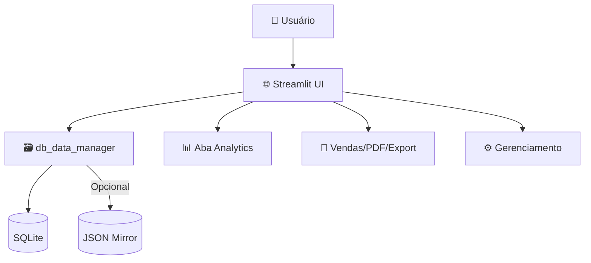

<div align="center">

# 🎟️ Plataforma de Rifas PRO

<p align="center">
  
</p>

<h3 align="center">✨ <em>Gerencie rifas de forma profissional, segura e com analytics avançado</em> ✨</h3>

<p align="center">
  
  
  
  
  
</p>

<p align="center">
  <a href="#-inicio-rapido">
    
  </a>
  <a href="#-funcionalidades">
    
  </a>
  <a href="#-deploy-com-docker">
    
  </a>
</p>

</div>

---

## 🚀 Início Rápido

<table>
<tr>
<td width="33%" align="center">

### 📥 **1. Instalar**
```bash
git clone [repo-url]
cd plataforma_rifas
pip install -r requirements.txt
```
<sub>Python 3.12+ recomendado</sub>

</td>
<td width="33%" align="center">

### 🔐 **2. Iniciar**
```bash
streamlit run app.py
# Acesse: http://localhost:8501
```
<sub>Interface web moderna</sub>

</td>
<td width="33%" align="center">

### 🐳 **3. Docker (opcional)**
```bash
docker compose up --build -d
```
<sub>Pronto para produção</sub>

</td>
</tr>
</table>

> 💡 Para publicar no Docker Hub, veja a seção "Publicar no Docker Hub" mais abaixo.

---

## ✨ Funcionalidades

<table>
<tr>
<td width="50%">

#### 🧩 Multiusuário & Segurança
- Login/cadastro com `bcrypt`
- Rate-limit/lockout após 5 tentativas (10 min)
- Rifas com `owner_id` e bloqueio de operações administrativas para não-donos

#### 🗃️ Persistência Robusta
- Banco `SQLite` como fonte de verdade
- Espelhamento JSON opcional (compatibilidade), controlado por `JSON_MIRROR`
- Backup JSON em um clique (ZIP) via UI

#### 🧾 Vendas & Comprovantes
- Venda com contato (telefone/WhatsApp)
- Cancelar/transferir vendas
- PDFs por comprador (consolidado, valor total, QR opcional, logo)
- Exportação CSV/XLSX com ajuste de fuso horário (`tz_offset_default`)

</td>
<td width="50%">

#### 📊 Analytics Avançado
- KPIs: Vendidos, Arrecadado, Únicos, Sell-through, Meta com progresso
- Período selecionável (24h, 7/30 dias, Tudo, Personalizado)
- Receita por dia e Receita acumulada
- Vendas por dia da semana e por hora (7/14/30)
- Heatmap Dia×Hora (Altair)
- Drill-down por dia (compradores, números, CSV e PDF do dia)

#### 🧱 UX & Operação
- Grade paginada com "Ir para número"
- Reservas com TTL e auto-liberação
- Aparência personalizada (logo, QR, observação padrão)

</td>
</tr>
</table>

---

## 🏗️ Arquitetura



---

## 🛠️ Stack Tecnológico

<table>
<tr>
<td width="33%" align="center">

#### 🐍 Backend


</td>
<td width="33%" align="center">

#### 🗃️ Dados


</td>
<td width="33%" align="center">

#### 📊 Visualização & Deploy


</td>
</tr>
</table>

---

## 📁 Estrutura do Projeto

```
plataforma_rifas/
├── app.py                     # Aplicação principal
├── modules/
│   ├── ui_components.py       # UI (grid, analytics, drill-down, PDFs)
│   ├── db_data_manager.py     # Regras de negócio + acesso SQLite + JSON backup
│   └── database.py            # Criação de tabelas/índices e conexão
├── data/                      # Banco e (opcional) JSONs/backs
│   └── rifas.db               # SQLite (fonte de verdade)
├── .streamlit/
│   └── config.toml            # Tema e configs do Streamlit
├── requirements.txt           # Dependências (inclui Altair)
├── Dockerfile                 # Imagem da aplicação
├── docker-compose.yml         # Orquestração, volumes e healthcheck
├── logger.py                  # Logging
└── README.md                  # Este arquivo
```

> ℹ️ JSONs legados em `data/*.json`, `data/_backups/`, `data/_reservas/`, `data/_sales/` podem ser removidos após migração para SQLite.

---

## ⚡ Instalação Completa (Manual)

```bash
# 1) Ambiente
python -m venv venv
venv\Scripts\activate  # Windows
# source venv/bin/activate  # Linux/Mac

# 2) Dependências
pip install -r requirements.txt

# 3) Executar
streamlit run app.py
```

---

## 🎯 Como Usar

1. Selecione/Crie uma rifa na barra lateral (com owner, se logado)
2. Aba "Dashboard & Vendas": venda, reserva e cancelamento
3. Aba "Consultar & Exportar": filtros por período/comprador, CSV/XLSX
4. Aba "📈 Analytics": KPIs, gráficos, heatmap, drill-down e PDF do dia
5. Aba "⚙️ Gerenciamento": configurações, logo/QR/observação, backup JSON e espelhamento JSON

---

## 🐳 Deploy com Docker

### Método Rápido
```bash
docker compose up --build -d
```

### Publicar no Docker Hub
```bash
# Login com Personal Access Token (PAT)
docker logout
docker login -u tassiosales  # cole o PAT no Password

# Build local (usa a tag do compose: tassiosales/plataforma_rifas:latest)
docker compose build

# Push para o Docker Hub
docker compose push

# Alternativa: retag + push manual
docker tag plataforma_rifas-plataforma_rifas:latest tassiosales/plataforma_rifas:latest
docker push tassiosales/plataforma_rifas:latest
```

### Produção puxando do Hub
No `docker-compose.yml`, deixe apenas:
```yaml
image: tassiosales/plataforma_rifas:latest
```
e rode:
```bash
docker compose up -d
```

---

## 🐛 Solução de Problemas

- **401/invalid_token no push**: refaça login com PAT e confirme o repo `tassiosales/plataforma_rifas` público.
- **compose push Skipped**: adicione `image:` no compose (já configurado) ou faça retag manual e `docker push`.
- **Porta 8501 ocupada**: ajuste a porta no compose (ex.: `8502:8501`).
- **Timezone**: ajuste `tz_offset_default` na rifa, e/ou `TZ` no compose.

---

## 🤝 Contribuição

1. Faça fork do projeto
2. Crie uma branch feature/nome
3. Envie PR com descrição clara

---

## 📄 Licença

Licença MIT.

---

<div align="center">

## ⭐ Apoie o Projeto

Se este projeto foi útil, deixe sua ⭐ e compartilhe!

**© 2025 - Plataforma de Rifas PRO**

</div>
