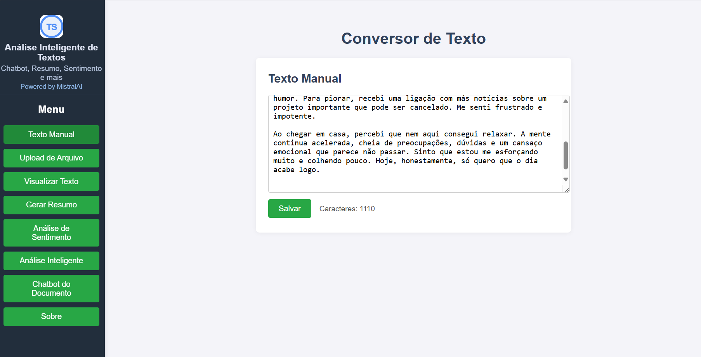
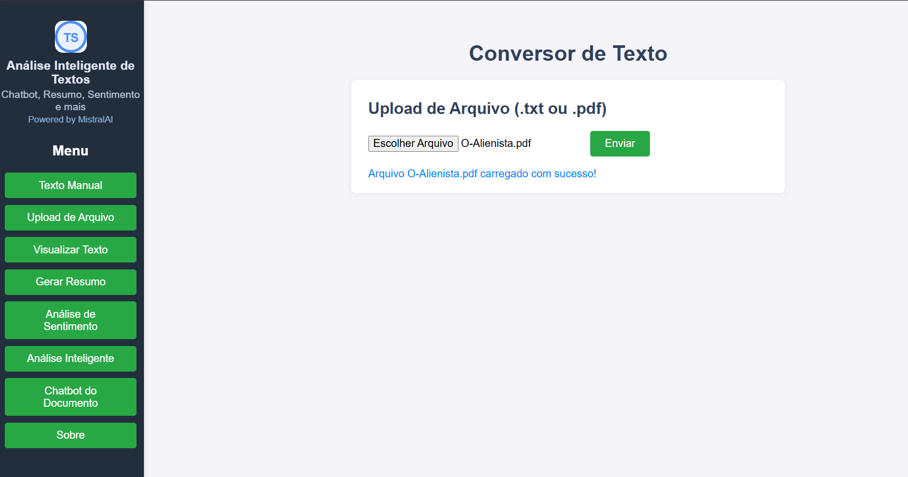
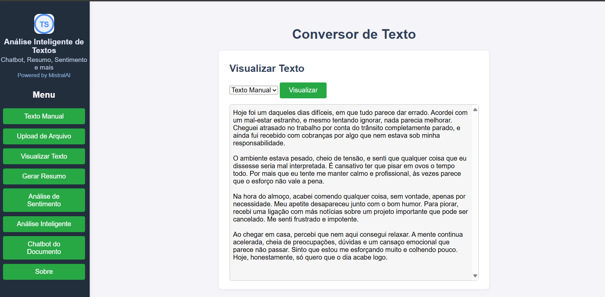
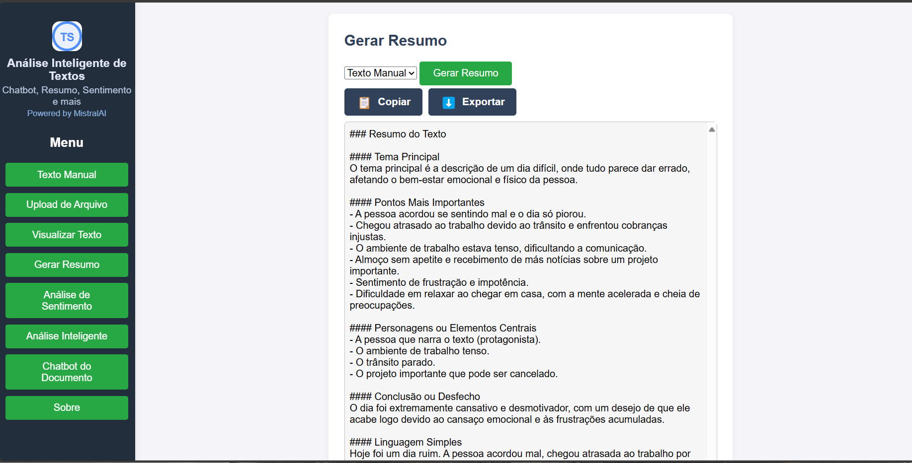
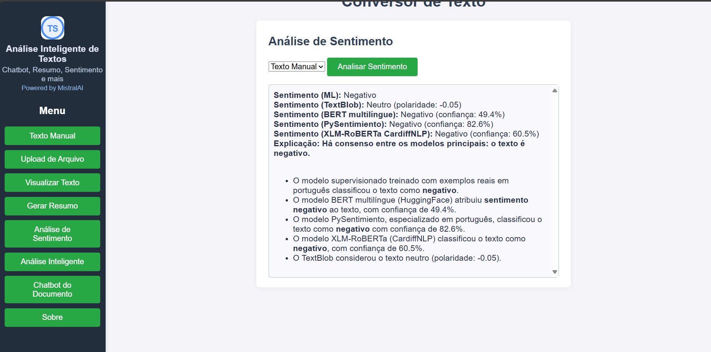
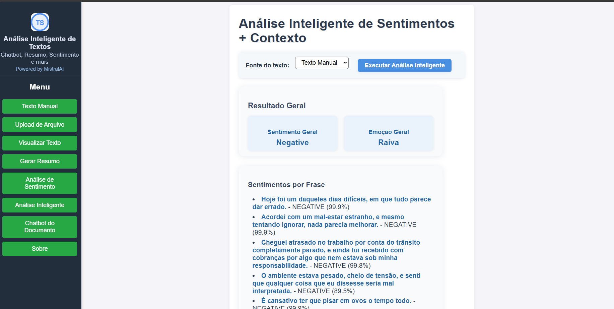

# 🧠 Análise Inteligente de Textos


Sistema web completo para análise avançada de textos em português, combinando IA generativa, análise de sentimentos, visualização de dados e chatbot contextual. Ideal para explorar, resumir, compreender e interagir com textos de qualquer tamanho de forma simples, visual e inteligente.

## 🚀 Principais Funcionalidades

- **Texto Manual:** Digite ou cole textos diretamente na interface para análise.
- **Upload de Arquivo:** Envie arquivos `.txt` ou `.pdf` para análise automática.
- **Resumo Automático:** Gere resumos de textos extensos usando IA (MistralAI).
- **Análise de Sentimento:** Avalie sentimento por frase e geral com múltiplos modelos (TextBlob, transformers, scikit-learn, pysentimiento, CardiffNLP).
- **Análise Inteligente:** Pipeline completo com extração de frases, geração de WordCloud, gráficos e insights contextuais (LlamaIndex).
- **Chatbot do Documento:** Faça perguntas sobre o texto carregado e obtenha respostas contextuais.
- **Visualização de Dados:** WordCloud de palavras-chave e gráficos de sentimentos.
- **Exportação e Cópia:** Copie ou baixe resultados facilmente.

## 🗂️ Estrutura do Projeto

```
projeto/
├── app.py                  # Servidor Flask principal, integra todos os módulos
├── analise_de_sentimento.py # Funções de análise de sentimento
├── analise_inteligente.py   # Pipeline de análise inteligente e visualização
├── resumo.py                # Geração de resumos automáticos
├── chatbot_backend.py       # Backend do chatbot contextual
├── requirements.txt         # Dependências Python
├── static/                  # Arquivos estáticos (CSS, JS, logo.svg)
├── templates/               # Templates HTML (interface web)
├── uploads/                 # Textos enviados pelo usuário
│   ├── manual_text.json     # Texto digitado
│   └── upload_text.json     # Texto extraído de upload
├── index/                   # Armazenamento de índices/contexto
├── logging_config.py        # Configuração de logs
└── ...
```

## ⚙️ Tecnologias Utilizadas

- [Flask](https://flask.palletsprojects.com/) • [Python](https://www.python.org/)
- [MistralAI](https://mistral.ai/) • [LlamaIndex](https://github.com/jerryjliu/llama_index)
- [Transformers (HuggingFace)](https://huggingface.co/transformers/) • [NLTK](https://www.nltk.org/)
- [TextBlob](https://textblob.readthedocs.io/en/dev/) • [scikit-learn](https://scikit-learn.org/)
- [PyPDF2](https://pypi.org/project/pypdf2/) • [matplotlib](https://matplotlib.org/) • [wordcloud](https://github.com/amueller/word_cloud)

## 📝 Instalação e Execução

1. **Pré-requisitos:**
   - Python 3.8+
   - `pip` instalado
   - Chave da API MistralAI (adicione ao `.env`):
     ```
     MISTRAL_API_KEY=SEU_TOKEN_AQUI
     ```
2. **Instale as dependências:**
   ```bash
   pip install -r requirements.txt
   ```
3. **Execute o servidor Flask:**
   ```bash
   python app.py
   ```
4. **Acesse no navegador:**
   - [http://localhost:5000](http://localhost:5000)

## 💡 Como Usar

1. Escolha o modo de entrada: digite texto ou faça upload de `.txt`/`.pdf`.
2. Visualize o texto carregado.
3. Gere resumo (opcional).
4. Execute análise de sentimento.
5. Veja análise inteligente, WordCloud e gráficos.
6. Use o chatbot para perguntas contextuais.
7. Baixe ou copie resultados.

## 🤝 Como Contribuir

1. Faça um fork deste repositório
2. Crie uma branch: `git checkout -b minha-feature`
3. Faça suas alterações e commit: `git commit -m 'minha contribuição'`
4. Envie para o fork: `git push origin minha-feature`
5. Abra um Pull Request

## 🖼️ Exemplos Visuais

Abaixo alguns prints ilustrando o funcionamento do sistema:

<p align="center">
  
  <br><em>1. Tela inicial do sistema</em>
</p>
<p align="center">
  
  <br><em>2. Upload de arquivo para análise</em>
</p>
<p align="center">
  
  <br><em>3. Geração de resumo automático</em>
</p>
<p align="center">
  
  <br><em>4. Análise de sentimento detalhada</em>
</p>
<p align="center">
  
  <br><em>5. Visualização WordCloud</em>
</p>
<p align="center">
  
  <br><em>6. Gráfico de distribuição de sentimentos</em>
</p>
<p align="center">
  
  <br><em>7. Chatbot contextual sobre o texto</em>
</p>

## 📚 Créditos e Referências
- [MistralAI](https://mistral.ai/)
- [LlamaIndex](https://github.com/jerryjliu/llama_index)
- [HuggingFace Transformers](https://huggingface.co/transformers/)
- [NLTK](https://www.nltk.org/)
- [TextBlob](https://textblob.readthedocs.io/en/dev/)
- [scikit-learn](https://scikit-learn.org/)
- [matplotlib](https://matplotlib.org/)
- [wordcloud](https://github.com/amueller/word_cloud)

## 👤 Autor

**Tassio Sales**  
GitHub: [@TassioSales](https://github.com/TassioSales)

## 📝 Licença

Distribuído sob a licença MIT. Veja o arquivo LICENSE para mais detalhes.
