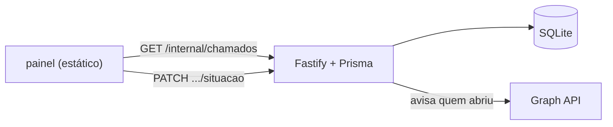

# Painel de Chamados

Quadro kanban que lê os chamados abertos pelo bot do [[WhatsApp Suporte]] e
devolve a mudança de situação — e, desde 2026-08-31, a classificação inteira do
chamado. **Quatro arquivos estáticos**, sem build e sem uma única dependência.

> [!info] Onde fica o quê
> Código em `activity-dashboard/` · esta nota em `activity-dashboard/docs/` · o
> guia de subir está no [README](../README.md) · **o lado do servidor** (rotas,
> CORS, token, view do banco) está em [[WA Painel de chamados]]. Volta para
> [[Projetos]].

## Como as peças se encaixam

O navegador **não** fala com o banco — não existe driver de SQLite no browser, e o arquivo está no disco do servidor.
Quem lê o banco é o servidor do bot, que já tem o pool, o token e os schemas.

## A ideia que faz o resto ser simples

**As colunas são os valores do enum `Situacao` do banco.** Não existe tabela de
conversão em lugar nenhum:

| coluna | `situacao` |
| --- | --- |
| A FAZER | `aberto` |
| EM ANDAMENTO | `em_andamento` |
| AGUARDANDO RESPOSTA | `aguardando_resposta` |
| RESOLVIDO | `resolvido` |
| FECHADO | `fechado` |
| CANCELADO | `cancelado` |

Arrastar um cartão para RESOLVIDO manda literalmente `situacao: "resolvido"`.
Situação nova no schema do Prisma entra aqui com o mesmo id e nada mais muda —
e foi exatamente o que aconteceu em 2026-08-31, quando `aguardando_resposta` e
`fechado` entraram: duas linhas em `columns`, no `data.js`.

O mesmo vale para os campos de classificação: as listas fixas (tipo, prioridade,
canal, impacto, urgência comercial…) vivem em `window.BOARD_DATA.listas`, e a
**chave** de cada item é literalmente o valor do enum no banco. Trocar um rótulo
ali não mexe em dado nenhum; acrescentar uma opção exige migração, porque são
enums do Prisma — ao contrário de **setor** e **assunto**, que são tabela e mudam
pelo próprio painel.

## O que ele não faz, de propósito

Isto é a parte mais importante da nota: as ausências são decisões, e cada uma
tem um motivo que vale reler antes de "consertar".

| Ausência | Por quê |
| --- | --- |
| editar resumo, descrição, solicitante | foram escritos pela pessoa na conversa e a API não expõe rota para alterá-los — campo editável que não persiste é pior que campo travado |
| excluir chamado | sumiria do quadro sem apagar nada no banco. Apagar dado de titular é obrigação de LGPD e tem caminho próprio e auditável: `npm run retencao -- --esquecer <telefone> --confirmar` |
| editar ou apagar comentário | o comentário é rastro da equipe, e rastro que se reescreve não é rastro. Mesmo desenho de `MudancaSituacao`. (Anexo, ao contrário, PODE ser excluído: é arquivo, e quem sobe o print errado precisa poder tirá-lo.) |
| arquivar / fechar semana | o histórico sai do banco pelo prazo de retenção, não por um botão de quadro |
| botão "salvar" na ficha do chamado | cada campo grava ao sair dele. Um botão criaria o estado "mudei e não salvei", que é onde o trabalho se perde quando alguém fecha a aba |

> **"Criar chamado" saiu desta lista.** Era uma ausência justificada enquanto todo
> chamado nascia na conversa. Desde que existe `POST /internal/tarefas`, o cartão
> criado aqui É uma linha do banco (com `origem = painel` fixado pelo servidor), e
> desde 2026-08-31 o formulário pede a classificação inteira. O que continua
> valendo: chamado criado no painel **não tem telefone**, então não recebe aviso
> no WhatsApp — e o quadro nem oferece a opção nesses cartões.

## Duas armadilhas de operação

> [!warning] Mover um cartão manda mensagem de WhatsApp para uma pessoa real
> A chave **"Avisar usuário ao mover"** vem **ligada**. Mensagem enviada não volta
> atrás. Antes de qualquer arrumação em lote do quadro, **desligue a chave**.
> Dois casos não disparam nada: voltar para A FAZER (não existe texto para
> `aberto`) e soltar o cartão na coluna onde ele já estava.

> [!warning] Abrir o `index.html` do disco não funciona
> Em `file://` a origem vira `null` e nenhum CORS sensato a libera. Precisa ser
> servido por HTTP, na **mesma porta** que está em `PAINEL_ORIGENS` no `.env` do
> bot.

## Dado pessoal

A API não devolve `telefone` — mesma minimização da view `chamados_para_cards`.
Mas **`nome`, `resumo` e `descricao` são dado pessoal** e aparecem na tela. Desde a
classificação há mais: `contato` e `franqueadoContato` (canais de contato
digitados pelo atendente), os comentários da equipe e **os anexos** — que podem
ser print de tela com dado de terceiro. O
painel exige token e não deve ficar aberto numa máquina sem supervisão.

O token fica em `sessionStorage` e morre ao fechar a aba, a não ser que a pessoa
marque *Lembrar neste navegador*. O padrão é **não** lembrar, de propósito: esse
token altera chamado e dispara mensagem de WhatsApp.

## O que precisa de atenção

- [ ] **Não está sob controle de versão** `[engenharia]` — a pasta não é um
      repositório git. São ~2.400 linhas de JS/CSS/HTML sem histórico e sem
      rede de proteção: um `Ctrl+S` errado é irrecuperável. É a única parte do
      produto de suporte fora do git, já que o [[WhatsApp Suporte]] tem
      repositório e remoto desde 2026-08-20. É a pendência mais barata de
      resolver e a de maior retorno deste vault.
- [ ] **Nenhum teste automatizado** `[engenharia]` — o `app.js` passou de mil
      para 3.243 linhas cobrindo render, filtros, arrastar-e-soltar, a ficha
      completa do chamado (24 campos, cada um gravando ao sair) e a atualização
      otimista (que **desfaz sozinha** se a API recusar). Nada disso é verificado.
      O lado do servidor tem 297 testes; este lado tem zero, e a distância entre os
      dois só aumentou com a classificação.
- [ ] **`apiBaseUrl` fica fixo no `data.js`** `[operação]` — apontar para outro
      ambiente é editar código e servir de novo. Aceitável para uso interno, mas
      é o que impede o mesmo arquivo de servir dev e produção.
