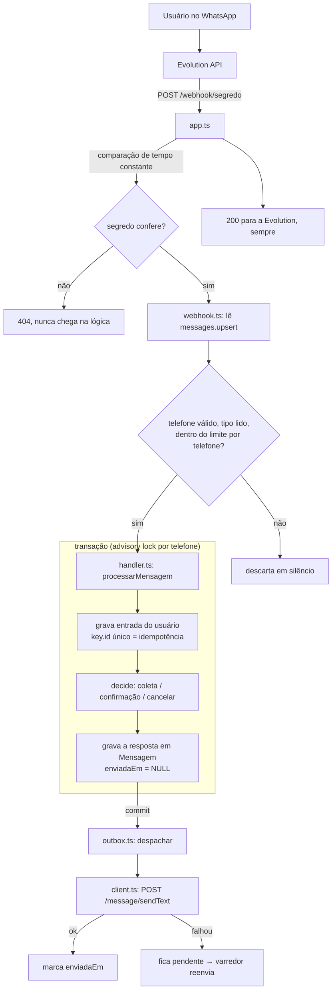

# WA Arquitetura

Volta para [[WhatsApp Suporte]].

## Caminho de uma mensagem

O 200 é devolvido de qualquer forma — ninguém reentrega depois de um
200. É por isso que o processamento nunca aborta o lote na primeira falha
(veja o `try/catch` por mensagem em [webhook.ts](../src/whatsapp/webhook.ts)) e
por isso a resposta ao usuário depende da outbox, não do sucesso do POST.

## As duas pontas humanas

O diagrama acima é o meio de campo. As duas pontas que uma pessoa vê são a
conversa no WhatsApp (por onde o chamado **entra**) e o painel de chamados (por
onde a equipe **atende**) — os dois lendo e escrevendo o mesmo banco.

![[conversa-whatsapp-1.jpg]]
*A entrada: o usuário abre o chamado por um fluxo guiado, sem IA. Detalhe em
[[WA Fluxo da conversa]].*

![[painel-quadro.jpg]]
*O atendimento: o painel lê os mesmos chamados do banco e devolve a mudança de
situação. Detalhe em [[WA Painel de chamados]].*

## Camadas

| Camada | Arquivos | Responsabilidade |
| --- | --- | --- |
| borda HTTP | [app.ts](../src/app.ts), [server.ts](../src/server.ts) | rotas, segredo do webhook, rate limit, boot, shutdown, timers |
| adaptação do payload | [whatsapp/webhook.ts](../src/whatsapp/webhook.ts), [whatsapp/telefone.ts](../src/whatsapp/telefone.ts), [whatsapp/throttle.ts](../src/whatsapp/throttle.ts) | traduz o envelope Baileys da Evolution em `Entrada`, valida telefone, limita por telefone |
| regra de conversa | [conversation/handler.ts](../src/conversation/handler.ts), [conversation/flows.ts](../src/conversation/flows.ts), [conversation/sessoes.ts](../src/conversation/sessoes.ts) | máquina de etapas, textos, limites, TTL de sessão |
| saída | [whatsapp/outbox.ts](../src/whatsapp/outbox.ts), [whatsapp/client.ts](../src/whatsapp/client.ts), [whatsapp/indisponibilidade.ts](../src/whatsapp/indisponibilidade.ts) | fila de saída, retry, varredor, aviso fora-do-banco |
| operação humana | [internal/chamados.ts](../src/internal/chamados.ts) | `PATCH` de situação por atendente |
| transversal | [config.ts](../src/config.ts), [log.ts](../src/log.ts), [db/client.ts](../src/db/client.ts) | validação de env, logger sem dado pessoal, PrismaClient |

Detalhe de cada arquivo em [[WA Mapa de arquivos]].

## Rotas

| Rota | O que faz | Respostas |
| --- | --- | --- |
| `GET /health` | liveness; **não** toca o banco de propósito | 200 |
| `GET /ready` | readiness; faz `SELECT 1` | 200 / 503 |
| `POST /webhook/:segredo` | recebe mensagens; segredo comparado em tempo constante | 200 sempre; **404** com segredo errado; 400 JSON inválido |
| `PATCH /internal/chamados/:id/situacao` | atendente muda situação | 200 / 400 / 401 / 404 |

`/health` e `/ready` ficam **fora do rate limit**: um health check de 10 em 10
segundos não pode consumir a cota do webhook.

## Três decisões que moldam o resto

### 1. `criarApp()` separado de `server.ts`

[app.ts](../src/app.ts) monta o Fastify e devolve; [server.ts](../src/server.ts)
é quem sobe porta, timers (varredor, limpeza de sessões) e trata sinais. É o que
permite os testes exercitarem rota real com `app.inject()` — sem abrir porta e
sem varredor rodando por baixo. Ver [[WA Testes e verificação]].

### 2. O segredo do webhook vive no caminho, não num cabeçalho

A Evolution não assina o corpo nem manda cabeçalho de autenticação: o que ela
permite configurar é a **URL**. Daí `POST /webhook/:segredo`, comparado em tempo
constante, com **404** — e não 401 — quando não confere: um 401 confirmaria que
existe um webhook naquele caminho.

O que se perdeu nisso merece estar escrito. O HMAC da Meta era calculado sobre
os bytes crus e provava **duas** coisas: quem chamou, e que o corpo chegou
intacto. Um segredo no caminho prova só a primeira. Some-se que caminho de URL
aparece em log de proxy, e cabeçalho não. Consequências práticas: o webhook tem
de ser HTTPS, o segredo é longo e rotacionável, e `req.url` entrou na lista de
`redact` do logger.

O `addContentTypeParser` com `parseAs: 'buffer'` **saiu** junto: sem HMAC sobre
bytes crus, não havia mais razão para guardar o corpo bruto.

### 3. Rede nunca acontece dentro de transação

Tanto em [handler.ts](../src/conversation/handler.ts) quanto em
[internal/chamados.ts](../src/internal/chamados.ts) o padrão é o mesmo: decidir e
**enfileirar** dentro da transação, `despachar` depois do commit. Uma chamada
HTTP lenta seguraria o lock de escrita **do arquivo inteiro** pelo tempo da rede
— com SQLite isso é mais grave que com Postgres, onde o lock era de uma linha ou
de um advisory lock por telefone.

## Serialização por telefone

Não há instrução nenhuma. **A transação é a serialização.**

O banco é um arquivo SQLite, que aceita um escritor por vez, e o adaptador do
Prisma segura um mutex do `BEGIN` até o commit — então duas transações deste
processo nunca se sobrepõem. Duas mensagens do mesmo telefone chegando juntas liam
a mesma etapa e uma sobrescrevia a outra; hoje a segunda espera a primeira
terminar.

No Postgres isso exigia um lock explícito, `pg_advisory_xact_lock(hashtext(
$telefone))`, que serializava **apenas** quem disputava o mesmo telefone. O que se
ganhou foi simplicidade; o que se paga é vazão — telefones diferentes agora também
esperam um pelo outro. Com dezenas de mensagens por minuto e transações de
milissegundos, isso não aparece.

> [!danger] O corolário é o desenho inteiro: uma instância
> Como a serialização vem de um mutex **do processo**, ela não atravessa
> processos. Duas instâncias no mesmo arquivo brigam pelo lock de escrita do
> SQLite. Ver [[WA Banco de dados]].

> [!note] `hashtext` pode colidir
> Dois telefones diferentes podem cair no mesmo hash e se serializar sem
> necessidade. O efeito é só perda de paralelismo, nunca corrupção — por isso o
> hash basta e não há tabela de locks.

A transação usa `maxWait: 5s` e `timeout: 15s`. Uma fila longa no mesmo telefone
estoura por `maxWait` e a mensagem é reentregue pela Evolution.

## Processos de fundo

Ambos criados em [server.ts](../src/server.ts), ambos com `timer.unref()` para
não segurar o processo no shutdown:

- **varredor da outbox** — a cada `VARREDOR_INTERVALO_SEGUNDOS` (60s), reenvia
  pendentes. Ver [[WA Outbox e entrega]].
- **limpeza de sessões** — a cada `LIMPEZA_SESSOES_MINUTOS` (60min), **e uma vez
  no boot**, descarta `SessaoConversa` abandonada (dado pessoal). Ver
  [[WA Segurança e LGPD]].

O `SIGTERM`/`SIGINT` fecha o Fastify (deixa requisição em voo terminar) e só
então desconecta o Prisma.

## Estado compartilhado entre instâncias

`throttle.ts` (contagem por telefone) e `indisponibilidade.ts` (último aviso por
telefone) não guardam mais estado próprio: os dois usam
[estado/janelas.ts](../src/estado/janelas.ts), que tem **duas implementações
escolhidas no boot** por `REDIS_URL`.

| `REDIS_URL` | onde o limite vive | quando é o certo |
| --- | --- | --- |
| vazia (padrão) | memória do processo | **uma** instância — o caso de hoje, já que o `render.yaml` não declara `numInstances` |
| definida | Redis, chaves prefixadas por `REDIS_PREFIXO` | duas ou mais instâncias |

> [!warning] O que isso resolveu, e por que não era visível
> Com estado em memória e N instâncias, cada processo tem a sua contagem e **o
> limite efetivo vira N × o configurado**. Nada quebra, nada aparece no log: o
> sistema só passa a aceitar 20 mensagens por minuto **por instância** em vez de
> 20 no total. Era a principal barreira para escalar horizontalmente.
>
> Como é o tipo de coisa que se descobre tarde, o boot agora **diz em qual dos
> dois modos subiu** (ver `src/server.ts`).

> [!note] Falha do Redis não desliga o limite
> Ela cai para a implementação em memória — o limite volta a valer por
> instância, que é o comportamento que este projeto teve até aqui.
>
> Das três saídas possíveis, é a única que não troca um problema por outro pior:
> **fechar** (recusar tudo) descartaria mensagem de gente real em silêncio;
> **abrir** (permitir tudo) removeria o único controle de abuso que existe
> depois do segredo do webhook, já que todo tráfego legítimo vem do mesmo
> lugar e limitar por IP não separa nada.

As operações são atômicas numa ida só, em Lua. Não é preciosismo: `INCR` seguido
de `PEXPIRE` em dois comandos deixa uma chave **sem prazo** se o processo morrer
entre eles — e aquele telefone ficaria bloqueado para sempre.

A outbox reserva o lote em **uma instrução só** (`UPDATE ... RETURNING`), que é
atômica por si. No Postgres ela usava `FOR UPDATE SKIP LOCKED` justamente para
duas instâncias não pegarem a mesma linha.

> [!danger] Isto ficou teórico: com SQLite não há segunda instância
> O banco é um arquivo com um escritor. Enquanto for assim, `REDIS_URL` resolve um
> problema que não chega a acontecer — e continua no código porque a alternativa
> era jogar fora a única parte que já estava pronta para a frota. Ver
> [[WA Banco de dados]] e [[WA Implantação]].
