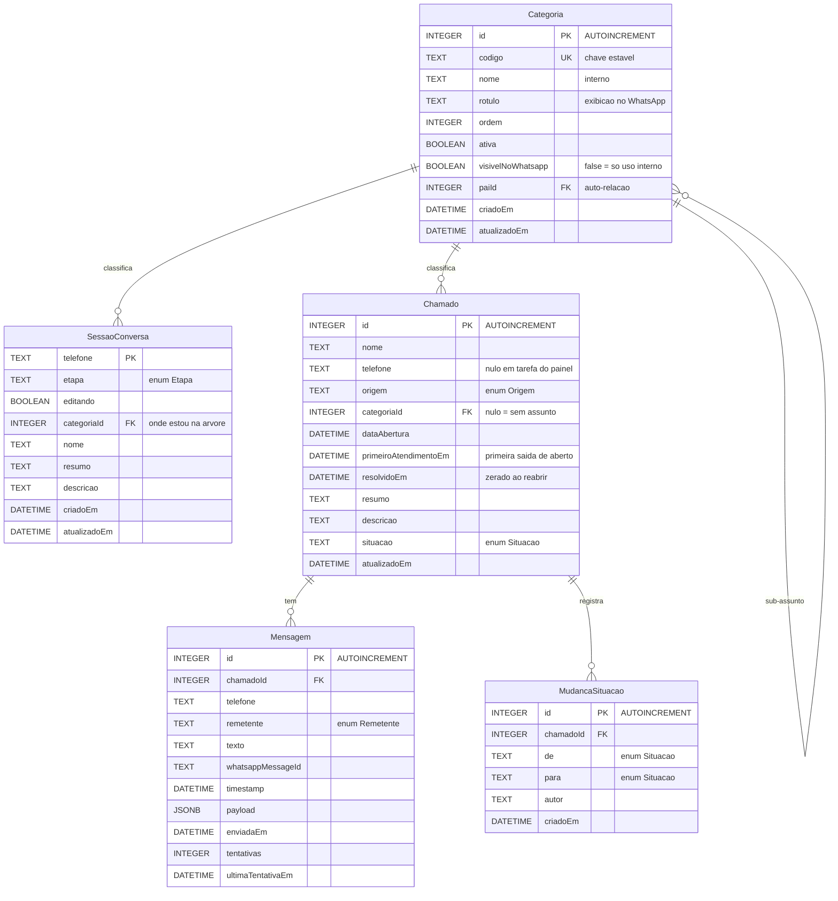

# WA Banco de dados

Volta para [[WhatsApp Suporte]].

Schema: [prisma/schema.prisma](../prisma/schema.prisma) · migração inicial:
[prisma/migrations/20260827200659_init/migration.sql](../prisma/migrations/20260827200659_init/migration.sql)
· view: [sql/view_chamados_para_cards.sql](../sql/view_chamados_para_cards.sql)
· caminho do arquivo: [src/db/caminho.ts](../src/db/caminho.ts) · conexão:
[src/db/client.ts](../src/db/client.ts)

## O banco é um arquivo

**SQLite.** Um arquivo, por padrão em `dados/whatsapp-suporte.db`, apontado pelo
`DATABASE_URL`:

```
DATABASE_URL="file:./dados/whatsapp-suporte.db"
```

Não há servidor, porta, usuário nem senha. Nada para instalar, nada para subir
antes de rodar o bot, nada para preencher no `.env` — o valor acima funciona como
está. Em produção o caminho é absoluto e aponta para o disco montado:
`file:/app/dados/whatsapp-suporte.db` (ver [[WA Implantação]]).

> [!info] O caminho relativo é resolvido contra a raiz do projeto
> E não contra o diretório de onde você rodou o comando. Quem faz essa conta é
> [src/db/caminho.ts](../src/db/caminho.ts), usado tanto pelo runtime quanto pelo
> `prisma.config.ts` — é o que garante que `npm run dev`, `npm run prisma:deploy`
> e um `npm run retencao` no agendador abram o **mesmo** arquivo. Sem isso a falha
> não seria um erro: o segundo comando criaria um banco vazio do lado e o
> servidor passaria a atender sem os dados.

A URL **não aceita parâmetros** (`?algo=1`): tudo depois de `file:` é tratado
como nome de arquivo, então a query string viraria parte do nome.

### Três arquivos, não um

Com o WAL ligado (ver abaixo), o banco são três arquivos:

| arquivo | o que é |
| --- | --- |
| `whatsapp-suporte.db` | o banco |
| `whatsapp-suporte.db-wal` | escritas ainda não incorporadas ao arquivo principal |
| `whatsapp-suporte.db-shm` | memória compartilhada entre leitores e o escritor |

Copiar só o `.db` de um banco em uso **perde as escritas mais recentes**. Para
cópia de segurança, use `VACUUM INTO` (ver [Backup](#backup)).

## Um escritor por banco

Esta é a propriedade do SQLite que mais afeta o desenho deste sistema, e a única
que vale decorar: **um escritor por banco**.

Dentro deste processo isso é resolvido pelo adaptador do Prisma, que segura um
mutex do `BEGIN` até o commit — duas transações nunca se sobrepõem. É daí que vem
a serialização que antes era feita com lock explícito do Postgres:

| antes (Postgres) | agora (SQLite) |
| --- | --- |
| `pg_advisory_xact_lock(hashtext(telefone))` no [handler](../src/conversation/handler.ts) | nada — o mutex do adaptador serializa **todas** as transações |
| `SELECT ... FOR UPDATE` em [chamados.ts](../src/internal/chamados.ts) | `findUnique` dentro da mesma transação |
| `FOR UPDATE SKIP LOCKED` na reserva da [outbox](../src/whatsapp/outbox.ts) | nada — uma instrução `UPDATE ... RETURNING` já é atômica |

O efeito observável é o mesmo, e é isso que a checagem contra banco de verdade
confere (ver [Garantias](#garantias-que-só-o-arquivo-de-verdade-prova)). O que se
paga é vazão: mensagens de telefones diferentes agora esperam uma pela outra. Com
o volume deste bot — dezenas de mensagens por minuto, transações de
milissegundos — isso não aparece.

> [!danger] Uma instância, sempre
> Duas instâncias apontadas para o mesmo arquivo brigam pelo lock de escrita, e o
> mutex do adaptador não atravessa processos. Não declare `numInstances` no
> `render.yaml` e não ligue autoscaling. Antes disto o limite para escalar
> horizontalmente eram os contadores em memória, coisa que `REDIS_URL` resolvia
> (ver [src/estado/janelas.ts](../src/estado/janelas.ts)); agora o limite é o
> banco, e `REDIS_URL` não muda nada.

`DB_BUSY_TIMEOUT_MS` (padrão 10s) é quanto esperar pelo lock antes de devolver
`SQLITE_BUSY`. Não é pool — não existe pool. Ele vale para quando **outro
processo** está escrevendo: o `npm run retencao` do agendador, o `npm run db:view`
do deploy, um `sqlite3` aberto para conferir dado.

### WAL

`prepararBanco()` ([src/db/client.ts](../src/db/client.ts)) liga
`journal_mode = WAL` no boot. O modo fica gravado no arquivo, então na prática só
tem efeito na primeira execução.

Vale porque um banco novo nasce em `journal_mode = delete`, onde leitor e escritor
se excluem: com um `sqlite3 dados/whatsapp-suporte.db` aberto para conferir dado —
coisa que esta documentação manda fazer — a escrita do webhook bloquearia. Com
WAL, leitura e escrita convivem.

O mesmo `prepararBanco()` **confere** que `PRAGMA foreign_keys` está ligado, e
estoura se não estiver. Não é paranoia: o driver liga por padrão, mas se algum dia
deixar de ligar, o `ON DELETE CASCADE` de `MudancaSituacao` simplesmente para de
acontecer — sem erro nenhum, e o problema aparece meses depois, na retenção.

## Onze tabelas

> [!info] A classificação de chamados acrescentou cinco
> `Setor`, `Comentario`, `Anexo`, `Tag` e `Dependencia`, mais 24 colunas em
> `Chamado` — na migração `20260831135505_classificacao_de_chamados`. O diagrama
> abaixo mostra as seis originais; as novas e o **por quê** de cada decisão de
> modelagem estão em [[WA Classificação de chamados]]. O resumo em uma linha cada:
>
> | tabela | o que guarda | decisão que merece leitura |
> | --- | --- | --- |
> | `Setor` | as áreas da empresa que atendem (TI, Financeiro, RH…) | é tabela e não enum, como `Categoria` — e **não** se confunde com ela: assunto é o que o cliente lê no WhatsApp, setor é quem atende |
> | `Comentario` | nota **interna** da equipe | separada de `Mensagem` para a nota nunca ser despachada ao cliente pela outbox |
> | `Anexo` | o binário do arquivo, em `BLOB` | dentro do próprio `.db`, para o backup levar tudo junto e o `CASCADE` da LGPD apagar de verdade |
> | `Tag` | etiqueta livre, `nome` único | muitos-para-muitos **implícito**: não há nada a guardar sobre a ligação |
> | `Dependencia` | "este chamado está travado esperando aquele" | duas FKs para `Chamado` com nomes de relação opostos; ciclo de dois é recusado na rota |
>
> `Chamado` também ganhou **duas** FKs para `Setor` (`setorId` = quem resolve,
> `setorOrigemId` = quem pediu) e uma para `Pessoa` (`responsavelId`, com
> `SetNull`).

### As seis originais



| tabela | vida | papel |
| --- | --- | --- |
| `SessaoConversa` | **efêmera** — uma linha por telefone, apagada ao confirmar o chamado | estado da coleta em andamento |
| `Chamado` | permanente (até a retenção) | o chamado propriamente dito |
| `Mensagem` | permanente (até a retenção) | log bruto dos dois sentidos **+ outbox de saída** |
| `MudancaSituacao` | vive e morre com o `Chamado` (`ON DELETE CASCADE`) | auditoria de atendimento: de/para, autor, quando |
| `Categoria` | permanente, e **editada no painel** | a árvore de assuntos que o menu do WhatsApp oferece e que separa os números do dashboard |

### Enums e tipos, do jeito que o SQLite guarda

O SQLite tem cinco tipos de armazenamento e nenhum deles é data, enum ou JSON. O
Prisma continua declarando tudo isso no schema e **valida no cliente**; o que
muda é como fica no arquivo:

| no schema | na coluna | observação |
| --- | --- | --- |
| `enum Etapa`, `Situacao`, `Remetente`, `Origem` | `TEXT` | o Prisma recusa valor fora da lista, como o Postgres recusava |
| `DateTime` | `TEXT` ISO-8601 com offset | `2026-08-27T19:57:00.604+00:00`, sempre UTC |
| `Json` | `TEXT` (coluna declarada `JSONB`) | serializado e desserializado pelo Prisma |
| `Int @id @default(autoincrement())` | `INTEGER PRIMARY KEY AUTOINCREMENT` | |
| `Boolean` | `INTEGER` 0/1 (coluna declarada `BOOLEAN`) | |

Enums: `Etapa` (categoria, nome, resumo, descricao, confirmacao), `Situacao`
(aberto, em_andamento, aguardando_resposta, resolvido, fechado, cancelado),
`Remetente` (usuario, sistema), `Origem` (whatsapp, painel).

## `Categoria` é tabela, e não um `enum`

A lista de assuntos veio dos grupos de atendimento da empresa e **muda por
decisão de negócio**: entra um canal novo, um deixa de existir, o nome de
exibição é reescrito. `enum` do Prisma só muda com migração e deploy; tabela muda
no painel, por quem atende. Foi o que decidiu o formato.

Três colunas parecem redundantes e não são:

| coluna | para quem | muda? |
| --- | --- | --- |
| `codigo` | integração e testes | **nunca** — é a chave estável, e a API não deixa renomeá-la |
| `nome` | relatório interno | sim (é a coluna "Nome" da tela de origem) |
| `rotulo` | quem lê no WhatsApp | sim (é o "Nome para exibição") |

Os dois últimos divergem na prática: "PROBLEMAS RELACIONADOS AO SISTEMA VETOR"
internamente, "SUPORTE AO SISTEMA VETOR" para quem escolhe.

`ordem` **não é o número que o usuário digita**. O número é a posição entre as
irmãs oferecidas, calculada ao montar o menu (ver [[WA Fluxo da conversa]]). Se
fosse o mesmo número, desativar a segunda de seis abriria um buraco na contagem.

`ativa` existe para **desativar em vez de apagar**: chamado antigo continua
apontando para a categoria e o dashboard continua somando o histórico. Apagar de
verdade só quando nenhum chamado usa — e é a API que recusa (409), porque o
banco, sozinho, faria `SET NULL` e a classificação se perderia em silêncio.

`visivelNoWhatsapp` é um **segundo eixo**, e não um terceiro estado de `ativa`.
As duas colunas respondem perguntas diferentes:

| | `ativa` | `visivelNoWhatsapp` | escolhível no menu? | escolhível no painel? |
| --- | --- | --- | --- | --- |
| assunto de atendimento | ✓ | ✓ | sim | sim |
| **assunto de uso interno** | ✓ | — | não | sim |
| fora de circulação | — | (indiferente) | não | não |

O assunto de uso interno é o que a TI aplica à mão e o cliente nunca vê na
lista. Antes desta coluna ele não tinha como existir: escondê-lo do menu exigia
desativá-lo, e aí ele sumia também do seletor do painel — que é justamente onde
ele precisava estar. Quem lê a coluna é **uma só** consulta, `filhasNoMenu`
(`src/conversation/categorias.ts`), a mesma que monta o menu e da qual sai a
whitelist que interpreta a resposta.

Não há cascata para as filhas, e não precisa: o menu desce um nível por vez, e
um pai fora dele torna a subárvore inalcançável. Deixar a coluna das filhas
intacta é o que faz religar o pai devolver o ramo inteiro.

A auto-relação `pai`/`filhas` é a árvore. O `Chamado` guarda a **folha**
escolhida; o caminho até a raiz é reconstruído lendo a árvore, então mudar o pai
de uma categoria depois **não reescreve chamado nenhum**.

> [!warning] `onDelete` é `SetNull` nas duas pontas, e por motivos diferentes
> Em `Chamado`, porque apagar um assunto não pode apagar atendimento.
> Em `SessaoConversa`, porque apagar um assunto no painel não pode derrubar a
> conversa de quem está no meio do formulário.

## Os dois marcos de SLA são colunas, e não um `SELECT`

`primeiroAtendimentoEm` e `resolvidoEm` registram o mesmo evento que
`MudancaSituacao` — que continua sendo a auditoria. A duplicação é deliberada, e
a razão é de custo **e** de significado:

- derivar exigiria varrer o histórico inteiro a cada consulta do painel;
- "primeiro atendimento" é uma **regra** (a primeira saída de `aberto`, que não
  se repete se o chamado reabrir) que ficaria reimplementada em cada consumidor
  — e a segunda cópia é a que erra.

Aqui a regra é aplicada em UM lugar: `marcosDeSla`, em
[internal/chamados.ts](../src/internal/chamados.ts), dentro da mesma transação
que lê a situação anterior.

| coluna | preenchida quando | zerada quando |
| --- | --- | --- |
| `primeiroAtendimentoEm` | a situação sai de `aberto` pela primeira vez | **nunca** |
| `resolvidoEm` | a situação entra em `resolvido` | a situação sai de `resolvido` |

Zerar `resolvidoEm` ao reabrir não é detalhe: sem isso, a média de tempo de
resolução contaria uma resolução desfeita, e um chamado que voltou para `aberto`
apareceria como resolvido no relatório.

## `Mensagem` acumula dois papéis

A mesma tabela é o histórico da conversa **e** a fila de saída. As colunas de
outbox só valem para `remetente = 'sistema'`:

| coluna | papel |
| --- | --- |
| `payload` | corpo exato a postar na Evolution (para reenvio fiel) |
| `enviadaEm` | `NULL` = pendente. É o campo que define a fila |
| `tentativas` | rodadas de envio gastas (não requisições HTTP) |
| `ultimaTentativaEm` | quando foi a última rodada — base da espera crescente |

Detalhe do ciclo em [[WA Outbox e entrega]].

`chamadoId` é opcional porque a mensagem existe **antes** do chamado: ela é
vinculada no momento da confirmação.

`whatsappMessageId` (`wamid.*`) tem **índice único** e é `NULL` nas saídas — o
SQLite, como o Postgres, permite vários `NULL` sob `UNIQUE`, porque dois `NULL`
nunca são considerados iguais. É esse índice que descarta entrega repetida: a
segunda gravação derruba a transação inteira e o fluxo não avança duas vezes. Ver
[[WA Fluxo da conversa]].

## Por que `MudancaSituacao` tem `ON DELETE CASCADE`

`Mensagem` **não** tem cascade: a retenção apaga as mensagens antes do chamado,
de propósito, porque as duas têm prazos próprios e a contagem da simulação
precisa enxergar as duas. `MudancaSituacao` é o contrário — é registro filho, não
tem prazo próprio e não faz sentido sozinho.

Sem o cascade haveria só duas saídas, as duas ruins: `apagarChamadosAntigos`
passaria a **falhar na FK** ao apagar chamado antigo (quebrando a retenção, ou
seja a LGPD), ou a FK seria omitida e o `autor` ficaria órfão no banco para
sempre. Com cascade, apagar o chamado leva o histórico junto e a retenção não
precisou saber que esta tabela existe.

Isso é garantia do banco, não do código: dublê em memória não prova. Está na
checagem 6 do `npm run dev:verificar-banco`.

> [!warning] No SQLite o cascade depende de um PRAGMA
> `PRAGMA foreign_keys` é **por conexão**, e com ele desligado apagar o chamado
> não dá erro nenhum — só deixa o histórico órfão em silêncio. É por isso que
> `prepararBanco()` confere isso no boot em vez de confiar no padrão do driver.

## Índices e por que cada um existe

| índice | serve a |
| --- | --- |
| `SessaoConversa(atualizadoEm)` | varredura de sessões abandonadas (LGPD) barata mesmo com a tabela grande |
| `Chamado(situacao)` | filtro por situação |
| `Chamado(telefone)` | histórico do titular e `--esquecer` |
| `Chamado(dataAbertura)` | ordenação da view de cards e corte da retenção |
| `Chamado(categoriaId)` | o dashboard agrupa por assunto e o `DELETE` de categoria conta quem a usa; sem ele, as duas viram varredura da tabela inteira |
| `Chamado(resolvidoEm)` | a janela do resumo ("resolvidos entre X e Y") |
| `Categoria(ativa, visivelNoWhatsapp, ordem)` | **exatamente** a consulta que monta o menu: filtra pelas duas colunas e já devolve na ordem, sem sort |
| `Categoria(paiId)` | as filhas de um nó, em cada nível do menu |
| `Mensagem(whatsappMessageId)` **único** | idempotência de entrega |
| `Mensagem(telefone)` | histórico e `--esquecer` |
| `Mensagem(chamadoId)` | mensagens de um chamado |
| `Mensagem(telefone, timestamp)` | conversa em ordem |
| `Mensagem(remetente, enviadaEm, timestamp)` | **exatamente** a busca do varredor: filtra e já devolve ordenado, sem sort, parando no `LIMIT` |
| `MudancaSituacao(chamadoId, criadoEm)` | a única consulta que existe: o histórico DESTE chamado, do mais novo ao mais velho — filtro e ordenação numa varredura só |

> [!note] O índice do varredor poderia ser parcial
> `WHERE remetente = 'sistema' AND "enviadaEm" IS NULL` cobriria uma fração das
> linhas e ficaria muito menor. O SQLite suporta índice parcial, mas o Prisma não
> sabe declará-lo, então ele teria de viver numa migração à mão — e o
> `migrate dev` tentaria removê-lo. Registrado em [[WA Pendências]].

## Convenção de datas

Toda coluna de data é gravada pelo Prisma como **texto ISO-8601 com o
deslocamento explícito**, sempre em UTC:

```
2026-08-27T19:57:00.604+00:00
```

Não existe fuso de sessão para herdar, e é por isso que o schema não tem mais o
`@db.Timestamptz(3)` que toda coluna de data carregava no Postgres. A armadilha
antiga — `TIMESTAMP` sem fuso reinterpretado como hora local, que deixou o
varredor da outbox inerte por 3h em UTC-3 — **não existe aqui**. O histórico está
em [[WA Fuso horário sem timezone]], e vale ler antes de mexer em `WHERE` com
data, porque a lição de fundo continua valendo.

> [!danger] Em SQL crua, converta para número — nunca compare como texto
> `datetime('now')` devolve `2026-08-27 19:57:00`: espaço em vez de `T`, sem
> milissegundo, sem offset. Comparado como **texto** com o valor da coluna, o `T`
> (0x54) é maior que o espaço (0x20) — então toda linha pareceria estar no futuro
> e o varredor não reenviaria nada, nunca. É o mesmo sintoma do bug antigo, por
> outro motivo.
>
> A regra é converter as duas pontas com `unixepoch(coluna, 'subsec')`, que
> entende o offset do texto gravado:
>
> ```sql
> -- certo
> WHERE unixepoch(coalesce("ultimaTentativaEm", "timestamp"), 'subsec')
>     < unixepoch('now', 'subsec') - (30 * pow(2, tentativas))
>
> -- errado: comparação de texto
> WHERE coalesce("ultimaTentativaEm", "timestamp") < datetime('now')
> ```
>
> E ao **gravar** data em SQL crua, passe um `Date` como parâmetro (`${new
> Date()}`) em vez de usar `datetime('now')`: o Prisma serializa no mesmo formato
> em que grava as outras datas. Deixar o SQLite escrever gravaria um texto sem
> offset, e a comparação da próxima varredura leria errado.

Código via Prisma (`where: { campo: { lt: data } }`) nunca sofreu disso: a data
vai como parâmetro.

## Migrações

```bash
npm run prisma:generate   # gera o client (não é versionado)
npm run prisma:deploy     # produção: aplica as migrações versionadas
npm run prisma:migrate    # DEV apenas: migrate dev, pode resetar o banco
```

| migração | o que faz |
| --- | --- |
| `20260827200659_init` | baseline SQLite: tabelas, índices, FK |
| `20260827205637_categorias_e_sla` | `Categoria` (a árvore de assuntos) e os dois marcos de SLA |
| `20260831124955_cadastro_de_pessoas` | `Pessoa`: o cadastro compartilhado do painel |
| `20260831135505_classificacao_de_chamados` | `Setor`, `Comentario`, `Anexo`, `Tag`, `Dependencia` + 24 colunas em `Chamado`; semeia 11 setores |
| `20260917120000_assunto_de_uso_interno` | `Categoria.visivelNoWhatsapp` e o índice do menu refeito sobre as duas colunas |

O histórico de migrações do Postgres (`0_init`, `datas_com_fuso`,
`historico_situacao`, `tarefas_criadas_no_painel`) foi **substituído** por esta
baseline única. Aquele SQL não roda no SQLite — tipos, `ALTER TYPE` e
`timestamptz` não existem aqui — e mantê-lo faria `migrate deploy` falhar em todo
banco novo. Ele continua no histórico do git, se precisar consultar.

- O client do Prisma é **gerado, não versionado**. Por isso o CI roda
  `prisma:generate` antes do build.
- `migrate dev` precisa de um banco de sombra; com SQLite ele é criado em memória
  e não exige nada de você.

> [!warning] O que o `migrate` do SQLite faz diferente
> Ele não sabe alterar coluna. Mudança de tipo, de nulidade ou de nome vira
> "cria tabela nova, copia, apaga a antiga, renomeia" — o Prisma gera isso
> sozinho, mas **leia** a migração gerada antes de aplicar em produção: se um
> `DROP TABLE` aparecer sem o `INSERT INTO ... SELECT` antes dele, a migração
> apaga dado.
>
> **E a view precisa sair antes e voltar depois.** `DROP TABLE "Chamado"` estoura
> com `error in view chamados_para_cards: no such table: main.Chamado` enquanto a
> view aponta para ela — a migração para no meio, o banco fica com `new_Chamado` e
> sem `Chamado`, e o serviço morre. Aconteceu de verdade na primeira tentativa de
> `categorias_e_sla`. Duas migrações já carregam o par `DROP VIEW` / `CREATE VIEW`
> por isso (`20260827205637` e `20260831135505`), e **toda migração que reconstrua
> `Chamado` precisa carregar também** — o `npm run db:view` não serve, porque a
> migração roda em servidor sem ninguém por perto para rodar o script depois.
>
> Consequência prática: mexeu em `sql/view_chamados_para_cards.sql`? A cópia no fim
> da última migração tem de acompanhar, ou entre uma migração nova que só recrie a
> view.

### Vindo do banco em Postgres

Trocar de banco **não traz os dados**. `prisma migrate deploy` cria tabelas
vazias, e um dump de Postgres não é um arquivo SQLite (`pg_dump` produz SQL com
sintaxe que o SQLite não aceita — `COPY`, tipos, `SET`).

Se houver dado a preservar, o caminho é exportar as tabelas do Postgres e
inserir pelo Prisma, respeitando a ordem das FKs (`Chamado` → `Mensagem` /
`MudancaSituacao`) e sem tentar preservar os `id` gerados por sequência. É um
script de uma vez, não algo que o `migrate` faça.

## A view de cards

`chamados_para_cards` ([sql/…](../sql/view_chamados_para_cards.sql)) é a
interface de leitura para a outra plataforma: expõe `id`, `nome`,
`dataAbertura`, `resumo`, `descricao`, `situacao`, `origem` — e **não**
`telefone`.

`prisma migrate` **não gerencia views**. Duas consequências:

- recriar o banco do zero exige aplicar o arquivo de novo;
- migração que mexe em coluna usada pela view exige derrubá-la e recriá-la — e no
  SQLite isso é ainda mais frequente, porque toda alteração de coluna é feita
  recriando a tabela.

> [!danger] A view não é mais uma fronteira de permissão
> No Postgres dava para criar um usuário somente-leitura e conceder `SELECT`
> apenas nesta view. **No SQLite não existe usuário nem `GRANT`**: o controle de
> acesso é a permissão do arquivo no sistema operacional, tudo ou nada — quem tem
> o arquivo tem TODAS as tabelas, telefone incluído — e, desde a classificação,
> também os anexos, que moram como BLOB dentro do mesmo arquivo.
>
> A view continua valendo como **contrato de leitura**: ela define quais colunas o
> consumidor vê. Mas para expor os cards sem entregar o banco, use a rota
> `/internal/chamados` (mesma minimização de campos, com token) ou entregue uma
> **cópia** do arquivo aberta em modo `readonly`. Ver [[WA Segurança e LGPD]].

### `npm run db:view`

[aplicar-view.ts](../src/scripts/aplicar-view.ts) derruba a view e executa o
arquivo SQL. É idempotente — rode depois de **toda** migração.

| onde roda | quando |
| --- | --- |
| `preDeployCommand` do Render | junto do `prisma:deploy`, em todo deploy |
| CI (job `banco`) | depois das migrações — um erro na SQL da view derruba o build, não a produção |
| sua máquina | `npm run dev:view` (ou `npm run db:view` depois do build) |

O `DROP` mora no script, e não no `.sql`, por um motivo do driver: ele prepara uma
instrução por chamada, então um arquivo com `DROP;` e `CREATE;` estouraria. E não
existe `CREATE OR REPLACE VIEW` no SQLite.

## Garantias que só o arquivo de verdade prova

Oito comportamentos dependem do banco real e **não** aparecem nos testes em
memória:

1. o **formato** em que a data é gravada, e que ela é comparável com o `now()` do
   banco em SQL crua — o ponto exato que já derrubou o varredor da outbox;
2. duas mensagens simultâneas do mesmo telefone não se atropelando;
3. dois `PATCH` simultâneos no mesmo chamado gerando **uma** notificação;
4. o índice único rejeitando `whatsappMessageId` repetido;
5. a SQL de reserva da outbox (uma instrução só + espera crescente);
6. o `ON DELETE CASCADE` de `MudancaSituacao` — sem ele a retenção (LGPD) passa a
   falhar na FK ao apagar chamado antigo;
7. `_count` sobre uma relação, `orderBy` em lista (`[{ ordem }, { id }]`) e o
   filtro `paiId: null` — que em SQL é `IS NULL`, e não `= NULL`. Errado, o menu
   voltaria vazio e a conversa pularia a pergunta sem ninguém entender;
8. o `ON DELETE SET NULL` de `Categoria` → `Chamado`, que é a razão de a API
   recusar o `DELETE` de uma categoria em uso.

Para isso existe `npm run dev:verificar-banco` — ver
[[WA Testes e verificação]]. **Rodar antes de qualquer deploy que mexa em
transação ou SQL crua.**

## Operação

### Inspecionar

```bash
sqlite3 dados/whatsapp-suporte.db
```

```sql
.tables
.schema Mensagem
SELECT COUNT(*) FROM Chamado;
SELECT * FROM chamados_para_cards LIMIT 10;
-- pendentes na outbox
SELECT id, telefone, tentativas, "ultimaTentativaEm"
  FROM Mensagem WHERE remetente = 'sistema' AND "enviadaEm" IS NULL;
```

Com WAL ligado isto não bloqueia o servidor. Sem o `sqlite3` instalado,
`npm run dev:verificar-banco` e `npm run dev:simular -- estado` cobrem o essencial.

### Backup

O Postgres gerenciado fazia backup automático; **disco não**. O banco é um arquivo
com dado pessoal de gente real, então cópia de segurança é parte do serviço.

```bash
sqlite3 dados/whatsapp-suporte.db "VACUUM INTO 'backup-2026-08-27.db'"
```

`VACUUM INTO` produz uma cópia **consistente e compactada** com o servidor no ar —
é a forma certa. Copiar o `.db` com `cp` enquanto há escrita acontecendo perde o
que está no `-wal` e pode gerar um arquivo corrompido.

Restaurar é parar o serviço, trocar o arquivo (e apagar `-wal`/`-shm`) e subir de
novo.

### Espaço em disco

Apagar linha **não devolve espaço ao disco** sozinho: o SQLite marca as páginas
como reutilizáveis. Depois de uma limpeza grande de retenção, rode:

```bash
sqlite3 dados/whatsapp-suporte.db "VACUUM"
```

`VACUUM` reescreve o banco inteiro e precisa de espaço livre equivalente ao
tamanho dele. Ele bloqueia escrita enquanto roda — faça fora do horário de
atendimento.

### Recomeçar do zero

```bash
rm -f dados/whatsapp-suporte.db dados/whatsapp-suporte.db-wal dados/whatsapp-suporte.db-shm
npm run prisma:deploy
npm run db:view
```
