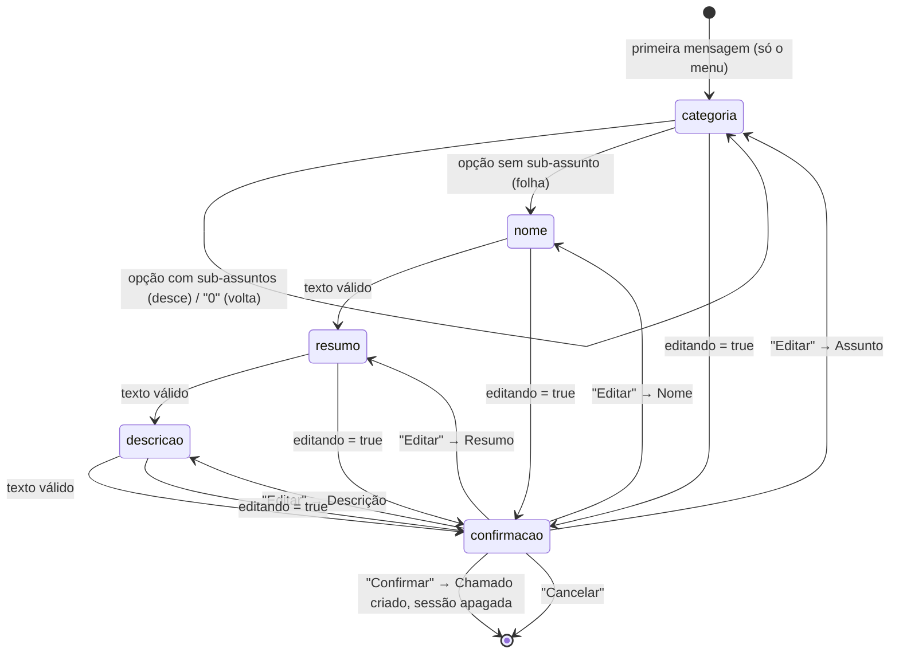

# WA Fluxo da conversa

Volta para [[WhatsApp Suporte]] · desenho geral em [[WA Arquitetura]].

Código: [conversation/handler.ts](../src/conversation/handler.ts) (decisão),
[conversation/flows.ts](../src/conversation/flows.ts) (etapas, textos, limites) e
[conversation/categorias.ts](../src/conversation/categorias.ts) (menu de assuntos).

## A conversa, do começo ao fim

O fluxo guiado: **assunto → nome → resumo → descrição → confirmação**. Nenhuma
etapa interpreta o texto — cada resposta vai direto para o campo. As telas abaixo
são uma conversa real, capturada com a Graph de mentira (ver [[WA Demonstração]]).

![[conversa-whatsapp-1.jpg]]
*Abertura: o bot oferece o menu de assuntos; a pessoa responde com o número, e o
fluxo segue para nome e resumo.*

![[conversa-whatsapp-2.jpg]]
*Fechamento: a descrição, o cartão de confirmação com os botões
**Confirmar / Editar / Cancelar** e o aviso final com o número do chamado
(`#12`) já gravado no banco.*

## Máquina de etapas



A etapa vive em `SessaoConversa.etapa`, uma linha por telefone. A flag
`editando` é o que faz a resposta voltar **direto para a confirmação** em vez de
seguir para a etapa seguinte.

`SessaoConversa` existe **só enquanto o chamado está sendo montado**: no
`confirmar`, o `Chamado` é criado e a sessão é apagada na mesma transação.

> [!important] A primeira mensagem não é resposta
> No primeiro contato a sessão é criada na etapa `categoria` e o bot responde com
> o **menu numerado de assuntos**, **sem consumir o texto que chegou**. Custa uma
> mensagem a mais por chamado.
>
> Até 2026-08-27 a sessão nascia em `nome` e a saudação era
> `Olá! Para abrir seu chamado, qual é o seu nome?`. A etapa de assunto entrou
> **antes** do nome, e não depois, porque perguntar o assunto no fim obrigaria a
> pessoa a lembrar o que veio fazer depois de já ter escrito tudo.
>
> Não era assim até 2026-08-20: a mensagem de abertura era gravada como nome, e
> quem escrevia "oi" ficava com `nome="oi"` — com o formulário inteiro deslizando
> um campo, porque o nome ia para o resumo e o resumo para a descrição. A
> pergunta existia em `flows.ts` e só era alcançável por expiração, mídia ou
> edição: nunca no caminho que todo usuário novo percorre. Encontrado ao ensaiar
> a apresentação ([[WA Demonstração]]), não pela suíte — o teste do fluxo feliz
> começava mandando `'Natan'`, que é um nome válido.
>
> `carregarSessao` devolve a **origem** da sessão (`existente`, `nova`,
> `reiniciada`) exatamente para isso: `nova` e `reiniciada` têm a mesma
> consequência — não consumir a mensagem — e avisos diferentes, porque quem está
> começando não precisa ouvir que a gente parou.

## A primeira pergunta: o assunto

O menu vem da tabela `Categoria` — **não** de um `enum`. A lista saiu dos grupos
de atendimento da empresa e muda por decisão de negócio; enum do Prisma só muda
com migração e deploy, tabela muda no painel, por quem atende. Ver
[[WA Banco de dados]] e [[WA Painel de chamados]].

```
Olá! Para abrir seu chamado, escolha o assunto do atendimento:

1. CADASTRO NO IFOOD
2. SUPORTE A FRANQUEADORA
3. MUDANÇA DE CNPJ
4. SUPORTE AO SISTEMA VETOR
5. SUPORTE AO FRANQUEADO
6. SUPORTE LOJA PRÓPRIA

Responda com o número da opção.
```

> [!important] O número NÃO é guardado em lugar nenhum
> O número é a posição dentro da lista de irmãs **oferecidas** — ativas e não
> marcadas como de uso interno —, calculada na hora de
> montar o menu — 1..N, sem buracos. A coluna `ordem` diz só a sequência.
>
> É o que faz desativar um assunto ser seguro: desativar a segunda de seis não
> pode fazer o menu pular do 1 para o 3, e reordenar no painel não pode exigir
> renumerar nada. O que vai para o banco é sempre o **id** da categoria.

Três formas de responder são aceitas, e todas passam pela mesma whitelist das
opções que **acabaram de ser oferecidas**:

| forma | exemplo | observação |
| --- | --- | --- |
| o número | `4` | o caminho principal, e o que o texto pede |
| tocar na linha da lista | id `cat_4` | protocolo interno; não funciona digitado |
| o rótulo por extenso | `mudanca de cnpj` | comparado normalizado (sem acento, minúsculas) |

A whitelist não é zelo: o WhatsApp mantém os botões antigos **clicáveis no
histórico**. Sem ela, tocar num menu de três mensagens atrás escolheria um
assunto que não está mais sendo oferecido — ou um nó de outro ramo da árvore.

> [!important] Assunto de uso interno
> Um assunto pode existir **só para a TI**: marcado como fora do WhatsApp no
> painel (`Categoria.visivelNoWhatsapp = false`), ele some do menu e continua no
> seletor de assunto do chamado. É um eixo **separado** de `ativa` — ver
> [[WA Painel de chamados]].
>
> Quem filtra é `filhasNoMenu`, a **mesma** consulta que monta as opções e da
> qual sai a whitelist acima. Por isso o assunto interno não é alcançável por
> nenhuma das três formas: nem pelo número que ele "teria" (a numeração fecha
> sobre os oferecidos), nem pelo rótulo digitado, nem por um toque num menu
> antigo do histórico.
>
> Um assunto **guarda-chuva** interno leva a subárvore junto: o menu desce um
> nível por vez, e um pai que nunca é oferecido nunca vira o nó cujas filhas são
> consultadas. As filhas ficam com a coluna intacta — religar o pai devolve o
> ramo inteiro.

### Árvore, e não lista plana

`Categoria` tem auto-relação `pai`/`filhas`. O menu desce **um nível por vez**: a
opção escolhida vira o novo nó, e o menu passa a oferecer as filhas oferecíveis
dele. Quando o nó não tem nenhuma, ele é a **folha** — a escolha está feita e a
etapa avança.

Enquanto a etapa é `categoria`, `SessaoConversa.categoriaId` é **onde a pessoa
está na árvore**, e não a escolha final. Os dois significados não se misturam
porque só um deles é possível por etapa. Por isso, ao entrar na etapa vindo do
menu de correção, a coluna volta a `null`: apontando para a folha antiga, o menu
ofereceria as filhas dela — que não existem — e a correção terminaria sem nunca
ter mostrado opção nenhuma.

Dentro de um sub-nível o menu oferece `0` para voltar um nível. Na raiz não há
para onde voltar, e `0` cai na recusa como qualquer outra opção fora da lista.

> [!important] O ramo pode sumir **debaixo** de quem já desceu
> `filhasNoMenu` filtra as filhas — o nó onde a pessoa está não passa por ele.
> Então marcar um guarda-chuva como de uso interno (ou desativá-lo) no painel não
> alcançaria, sozinho, quem já estava dentro dele: as filhas continuam com a
> coluna `true`, e seguiriam sendo oferecidas àquela conversa até a sessão
> expirar, horas depois.
>
> Por isso a etapa começa validando o nó (`noAindaOferecivel` sobe até a raiz
> conferindo `ativa` e `visivelNoWhatsapp` de cada ancestral). Se o ramo saiu de
> circulação, `SessaoConversa.categoriaId` volta a `null` e o menu raiz é enviado
> com o aviso `assuntoSaiuDoMenu`.
>
> **A resposta que chegou é descartada** nesse caso, e não reinterpretada: ela
> foi escrita lendo um menu que não vale mais. O "1" que era *PDV* seria, no menu
> raiz, um assunto inteiramente diferente — e o chamado nasceria classificado em
> algo que ninguém leu.

> [!note] Sem assunto oferecível, a etapa é pulada
> Se não houver nenhuma categoria oferecível cadastrada — nenhuma ativa, ou todas
> as ativas marcadas como de uso interno —, `acaoMenuCategoria` avança direto
> para `nome` e o chamado nasce com `categoriaId` nulo, que o schema aceita de
> propósito. Um dado de configuração faltando **não pode travar a conversa de
> quem precisa de suporte**.
>
> O mesmo caminho cobre o nó que fica sem filha oferecível — alguém desativou ou
> marcou como interna todas as filhas, no painel, enquanto a conversa acontece: o
> nó vira folha e o que já foi escolhido vale. É também o desenho do assunto
> guarda-chuva visível com **todos** os sub-assuntos internos: a conversa para no
> pai, que é o nível que o cliente sabe nomear, e o refino fica para quem atende.

## Entrada: três tipos, tratamento diferente

`Entrada` ([handler.ts](../src/conversation/handler.ts)) é um dos três:

| tipo | vem de | tratamento |
| --- | --- | --- |
| `texto` | `message.text.body` | valor do campo da etapa atual, ou comando se casar exato |
| `botao` | `message.interactive.button_reply.id` | comando interno; **só** por clique |
| `midia` | áudio, imagem, vídeo, documento, figurinha, localização, contato, resposta de lista | explica a limitação e **repete a pergunta atual**; nunca vira valor de campo |

> [!important] Por que separar clique de digitação
> Os ids (`confirmar`, `editar_descricao`) são protocolo interno. Se texto
> digitado fosse aceito como id, digitar `editar_descricao` viraria comando. Ao
> mesmo tempo, botão interativo **não renderiza em todo cliente** — então as
> *palavras humanas* são aceitas digitadas, senão o usuário ficaria preso na
> confirmação.

Palavras aceitas digitadas na confirmação
([handler.ts](../src/conversation/handler.ts)):

- confirmar → `confirmar`, `confirmo`, `confirma`, `sim`, `ok`
- editar → `editar`, `corrigir`, `alterar`, `mudar`, `nao`

O texto passa por `normalizar()`: `trim`, minúsculas e remoção de acentos via
`NFD` + faixa `̀-ͯ`. A faixa está escrita como escape de propósito —
com os caracteres literais, um problema de encoding no arquivo desligaria a
remoção de acentos em silêncio.

## Comandos globais

`cancelar`, `cancela`, `reiniciar`, `recomecar`, `sair`, `parar` — em qualquer
etapa, **e mesmo sem sessão existindo**.

Só valem por **igualdade exata** do texto normalizado. "preciso cancelar meu
pedido no site" é descrição legítima, não comando. Sem nada em andamento, a
resposta diz exatamente isso, em vez de afirmar que cancelou algo que nunca
existiu.

## Validação por campo

| campo | mínimo | máximo | rótulo |
| --- | --- | --- | --- |
| nome | 2 | 120 | Nome |
| resumo | 2 | 200 | Resumo |
| descricao | 2 | 2000 | Descrição |

Estourar o limite gera aviso amigável **com a contagem de caracteres** e repete a
pergunta — nada é truncado às escondidas.

Isso é diferente do corte duro de `MAX_CARACTERES_MENSAGEM` (4096) em
[whatsapp/webhook.ts](../src/whatsapp/webhook.ts), que existe só para barrar
payload forjado enchendo a coluna `texto` (que é `TEXT`, sem limite).

## Menu numerado: uma forma só

Constantes em [flows.ts](../src/conversation/flows.ts):

| constante | valor | por quê |
| --- | --- | --- |
| `MAX_CORPO_MENSAGEM` | 4096 | teto do corpo que o bot envia; mesmo número que `MAX_CARACTERES_MENSAGEM` aplica na entrada |
| `MAX_DESCRICAO_NO_RESUMO` | 500 | a descrição aparece encurtada no resumo da confirmação (o texto completo continua no banco) |

Essa tabela já foi maior. Com a Meta havia quatro constantes a mais —
`MAX_BOTOES` (3), `MAX_TITULO_BOTAO` (20), `MAX_LINHAS_LISTA` (10) e
`MAX_TITULO_LINHA` (24). Nenhuma existia por decisão de produto: eram tetos da
API que a regra tinha de respeitar, e estourá-los **recusava o envio**.

A Evolution envia texto puro. Não há botão, não há lista interativa, e por
consequência não há teto de 3, de 10 nem de 24 caracteres. As quatro saíram do
código junto com `corpoBotoes`, `corpoLista` e `botoesDoMenu`.

A quinta, `MAX_CORPO_INTERATIVO` (1024), **não saiu — mudou de nome e de
número**, e vale saber por quê. Ela era o limite do corpo de uma mensagem
interativa da Meta, e a migração a deixou para trás por engano: continuou
truncando o menu de assuntos e o resumo da confirmação em 1024 caracteres, sem
nenhuma API cobrando isso. Como `textoDoMenu` **descarta as opções que não
couberem**, era um jeito silencioso de perder item de menu conforme o cadastro
crescesse. Virou `MAX_CORPO_MENSAGEM = 4096`: um teto ainda existe (senão um
menu grande vira parede de texto), mas agora com folga de dezenas de assuntos.

O que ficou no lugar é `menuNumerado` ([client.ts](../src/whatsapp/client.ts)):
uma opção por linha, prefixada pelo número, e uma instrução no fim.

```
Confirma a abertura do chamado?

*Assunto:* CADASTRO NO IFOOD
*Nome:* Natan

1. Confirmar e abrir o chamado
2. Corrigir: Assunto
3. Corrigir: Nome
4. Cancelar

Responda com o número da opção.
```

`MAX_DESCRICAO_NO_RESUMO` também mudou de razão: não é mais caber nos 1024 da
API, é que um bloco de 2000 caracteres no meio da confirmação empurra as opções
para fora da tela.

### Isto simplificou uma armadilha inteira

Antes, o formato do envio dependia da **quantidade** de opções: até 3 virava
botão, de 4 a 10 virava lista, acima de 10 não cabia em lugar nenhum e o
excedente era descartado — o usuário perdia a opção sem nenhum aviso na
conversa, só uma linha de log. O menu "Qual informação deseja corrigir?" chegou
a encostar nesse limite quando o Assunto virou o quarto campo.

Hoje não há teto: acrescentar um campo é acrescentar uma linha.

> [!note] Os ids de botão continuam sendo lidos
> O bot não manda mais botão nenhum, mas o webhook ainda lê
> `buttonsResponseMessage.selectedButtonId` e
> `listResponseMessage.singleSelectReply.selectedRowId`. Não é código morto: uma
> conversa que estava no meio do fluxo na hora da migração recebeu botões antes
> e responderia com eles depois. Sem isso, ela ficaria sem resposta até a sessão
> expirar.

## Casos de borda que o código trata de propósito

| situação | comportamento |
| --- | --- |
| clique em botão antigo durante coleta | ignora o id e repete a pergunta atual — sem isso, `editar_nome` seria salvo *como* o nome da pessoa |
| resposta numérica fora da faixa do menu | recusa e repete o menu; `idDoNumero` só aceita dígitos, e só dentro da quantidade de opções oferecidas |
| texto livre na etapa de assunto | recusa e **repete o menu junto com o aviso** — só recusar deixaria a pessoa rolando a conversa para achar as opções de novo |
| `cat_<id>` de um menu antigo, de outro ramo | não está na whitelist do nível atual: cai na mesma recusa |
| assunto apagado no painel no meio da conversa | `SetNull` limpa a coluna da sessão; o menu volta da raiz em vez de derrubar a conversa |
| nenhum assunto ativo cadastrado | a etapa é pulada e o chamado nasce sem assunto |
| id de botão desconhecido (`editar_xyz`) | responde "Não reconheci essa opção"; antes virava `etapa` e explodia no banco, deixando o usuário sem resposta |
| `confirmar` com campo vazio | volta a perguntar o campo que faltou (`editando = true`), em vez de estourar `NOT NULL` |
| entrega duplicada (mesmo `key.id`) | índice único derruba a transação; a repetição é descartada sem avançar o fluxo. Ver [[WA Banco de dados]] |
| eco da própria mensagem do bot (`key.fromMe: true`) | descartado antes de tudo. Sem isso, o bot conversaria consigo mesmo em laço até a sessão expirar |
| mensagem de grupo (`@g.us`) ou broadcast | descartada: o fluxo é de atendimento individual, e o "telefone" de um grupo não identifica ninguém |
| evento que não é mensagem (`connection.update`, `qrcode.updated`) | 200 e nada mais — só `messages.upsert` entra no fluxo |
| sessão expirada (24h) | descarta, recomeça e **avisa** ("Faz um tempo que a gente parou...") |
| mídia na etapa de confirmação | repete o resumo com o menu, com o aviso antes |
| flood no mesmo telefone | descarta em silêncio — responder "você está enviando rápido demais" a quem faz flood só gera mais tráfego de saída |

## TTL da sessão: inatividade, não idade

`SESSAO_TTL_HORAS` (24h) conta **inatividade**. Toda mensagem "toca"
`atualizadoEm`, inclusive as que não mudam estado (entrada inválida) — senão uma
sequência de erros do usuário derrubaria a sessão no meio da conversa.

O corte é calculado por `corteExpiracao()` em
[conversation/sessoes.ts](../src/conversation/sessoes.ts), usado pelos **dois**
caminhos de descarte (o preguiçoso, no handler, e o periódico, no varredor de
sessões) — uma função só para os dois nunca discordarem.

## Vínculo das mensagens ao chamado

Ao confirmar:

```ts
where: { telefone, chamadoId: null, timestamp: { gte: sessao.criadoEm } }
```

O `gte: sessao.criadoEm` é o que limita o vínculo às mensagens **desta**
conversa. Sem ele, qualquer conversa abandonada meses atrás seria anexada ao
chamado novo.

## Textos do bot

Todos ficam juntos em `mensagens` e `perguntas`, em
[flows.ts](../src/conversation/flows.ts) — nenhum texto de usuário está solto no
meio da lógica. É o lugar para mexer em tom de voz sem tocar em regra.
