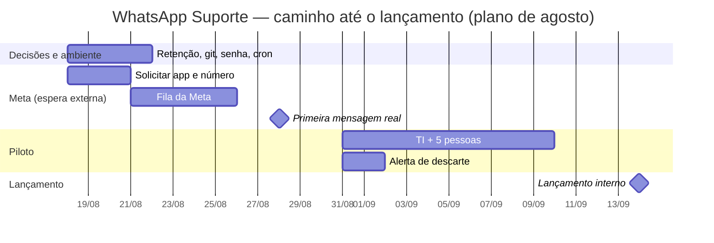

# WA Lançamento

Volta para [[WhatsApp Suporte]].

> [!info] Para que serve esta nota
> Duas coisas, na ordem em que uma apresentação precisa delas: **o que a
> plataforma faz** (para mostrar a quem decide) e **quando ela pode ir ao ar**
> (para combinar prazo). O detalhamento técnico de cada item continua nas notas
> específicas; o backlog cru continua em [[WA Pendências]].
>
> O **roteiro de execução** da demonstração — o que rodar, em que ordem e o que
> precisa aparecer na tela — está em [[WA Demonstração]].
>
> As datas são **estimativas**, não compromissos. As premissas que as sustentam
> estão em [[#Premissas da estimativa]] — mude uma premissa e a data muda.

## O que é, em uma frase

Um canal de suporte no WhatsApp que transforma conversa em **chamado
estruturado**: o usuário escolhe o assunto num menu, responde três perguntas,
confirma, e o chamado nasce no banco com assunto, nome, resumo, descrição e
situação — pronto para o painel de atendimento. **Sem IA em nenhum ponto**: cada
resposta vai direto para o campo correspondente, sem interpretação de conteúdo,
sem custo por token e sem alucinação possível.

![[conversa-whatsapp-1.jpg]]
*A abertura de um chamado pelo WhatsApp — conversa real (ver [[WA Demonstração]]).
O atendimento acontece no painel de chamados, mais abaixo.*

## Funcionalidades

### Para quem abre o chamado (WhatsApp)

| Funcionalidade                   | O que o usuário vê                                                                                                                                                          |
| -------------------------------- | --------------------------------------------------------------------------------------------------------------------------------------------------------------------------- |
| **Fluxo guiado em 5 etapas**     | `assunto → nome → resumo → descrição → confirmação`. Começa por um **menu de assuntos** (responde-se com o número, ou tocando na lista); as demais são uma pergunta por vez.  |
| **Confirmação com botões**       | Confirmar / Editar / Cancelar. Também aceita as palavras digitadas ("confirmar", "sim", "editar"), porque botão interativo não renderiza em todo cliente.                   |
| **Corrigir antes de enviar**     | Escolhe qual campo refazer (assunto, nome, resumo ou descrição) e volta para a confirmação. O menu se adapta ao número de opções: até três saem como botões, acima disso como lista. |
| **Cancelar quando quiser**       | `cancelar`, `reiniciar` ou `sair`, ou o botão. Só vale como comando se for a mensagem inteira — "preciso cancelar meu pedido no site" é tratado como texto normal.          |
| **Limites com aviso amigável**   | Nome 120, resumo 200, descrição 2000 caracteres. Estourar dá orientação, não erro.                                                                                          |
| **Aviso de indisponibilidade**   | Se o sistema não puder responder, o usuário recebe um aviso — no máximo um por telefone a cada 10 minutos, para não virar spam.                                             |
| **Retomada de sessão**           | Ficou 24h sem responder? A conversa recomeça avisando, em vez de continuar de um ponto que a pessoa já esqueceu.                                                            |
| **Aviso de mudança de situação** | Quando o atendimento resolve, cancela ou põe em andamento o chamado, o usuário é notificado no mesmo WhatsApp (opcional, decidido por chamado).                             |
| **Áudio, imagem e anexo**        | Recebem resposta explicando a limitação e a pergunta atual é repetida. A ocorrência fica registrada no histórico.                                                           |

O menu de correção não tem teto prático: o formulário hoje tem três campos, e
acrescentar um quarto não quebra a conversa — o menu passa sozinho de botões
para lista, sem opção sumir da tela. É o que torna barato o pedido mais provável
depois do piloto ("queria um campo de setor"). Ver [[WA Fluxo da conversa]].

### Para quem atende (integração com o painel)

| Rota                                    | Quem usa              | Para quê                                                                                                                                 |
| --------------------------------------- | --------------------- | ---------------------------------------------------------------------------------------------------------------------------------------- |
| `GET /internal/chamados`                | painel de atendimento | Lista os chamados, com filtro por situação e limite.                                                                                     |
| `PATCH /internal/chamados/:id/situacao` | painel de atendimento | Muda a situação (`aberto`, `em_andamento`, `resolvido`, `cancelado`), registra quem mudou e, se pedido, **avisa o usuário no WhatsApp**. |
| `GET /internal/chamados/:id/historico`  | painel de atendimento | Auditoria do atendimento: de que situação para qual, por quem e quando.                                                                  |
| `GET /health` · `GET /ready`            | infraestrutura        | "O processo está vivo?" e "as dependências estão de pé?" — perguntas diferentes, rotas diferentes.                                       |
| view `chamados_para_cards`              | quadro de cards       | Leitura pronta para um usuário de banco separado, com `SELECT` só nela.                                                                  |

O histórico registra o autor de cada mudança quando o painel manda o nome de quem
está atendendo — hoje ele ainda não manda, então as linhas gravadas até agora têm
o de/para e o quando, mas não o quem. É um ajuste no painel, não no servidor.

**Dois tokens, de propósito**: o do painel (`PAINEL_TOKEN`) vive no navegador de
cada atendente e pode ser revogado sozinho; o interno (`INTERNAL_API_TOKEN`)
vive em servidor. CORS liberado apenas para as origens declaradas. Ver
[[WA Painel de chamados]].

### Classificação e visão gerencial

Entregue **depois** da primeira versão desta nota, e hoje é boa parte do que se
mostra numa apresentação:

- **Chamado classificado** — além de nome/resumo/descrição, um chamado carrega
  assunto (árvore de categorias), setor que atende e setor que pediu, tipo
  (interno × franquia), prioridade, canal, prazo/SLA, urgência comercial,
  etiquetas livres, comentários internos, anexos e dependência entre chamados —
  **31 campos**, editáveis no painel. Ver [[WA Classificação de chamados]].
- **Quadro e Dashboard** — o quadro move o chamado entre situações (e avisa o
  solicitante, se marcado); o Dashboard resume fila aberta, aguardando 1º
  atendimento, prazo vencido, tempo até o primeiro atendimento (mediana) e as
  séries de abertos × resolvidos (rota `GET /internal/series`).

![[painel-quadro.jpg]]
![[painel-dashboard.jpg]]

- **Login por conta da empresa (Microsoft Entra ID)** — o painel exige conta do
  tenant; quem pode entrar é atribuído no App Registration, não numa lista no
  código, e o token da API deixa de ser digitado no navegador. Ver
  [[WA Painel de chamados]] e [[WA Segurança e LGPD]].

### O que garante que nada se perde

Esta é a parte que não aparece na tela e é a que sustenta a promessa de suporte —
vale mostrar numa apresentação como **diferencial de confiabilidade**:

- **Resposta nunca depende da rede dar certo.** A mensagem de saída é gravada na
  mesma transação que muda o estado da conversa; se a Evolution estiver fora, a
  linha fica pendente e um varredor reentrega com espera crescente. O usuário
  recebe a pergunta atrasada, não recebe silêncio. Ver [[WA Outbox e entrega]].
- **Entrega duplicada não avança o fluxo duas vezes.** Webhook é entregue "pelo
  menos uma vez"; o id da mensagem tem índice único e a repetição é descartada.
- **Duas mensagens ao mesmo tempo não se atropelam.** O processamento acontece
  dentro de uma transação, e o SQLite aceita um escritor por banco — então as duas
  nunca leem a mesma etapa.
- **Duas telas do painel não notificam o usuário duas vezes.** A situação é lida e
  gravada na mesma transação.
- **Datas sem armadilha de fuso.** O banco guarda data como texto ISO-8601 com
  offset explícito, sempre em UTC — não há fuso de sessão para herdar, e a classe
  de bug que deixou o varredor 3h inerte deixou de existir. Continua havendo uma
  regra a respeitar em SQL crua; ver [[WA Fuso horário sem timezone]].
- **Rate limit por telefone**, e reentrega do webhook devolve a cota gasta, para
  uma rajada de duplicatas não consumir o limite de um usuário legítimo.
- **E se, mesmo assim, uma mensagem se perder, alguém fica sabendo.** Esgotadas as
  tentativas — o único caso em que uma pessoa escreveu e não recebeu resposta —, um
  alerta vai para o canal da equipe (Slack, Discord ou qualquer coletor). Ele não
  leva telefone nem texto, e é agrupado por janela, para uma queda longa da
  Evolution não virar centenas de avisos iguais que ninguém lê. **Falta só criar o webhook
  e apontar `ALERTA_WEBHOOK_URL`** — item 6 de [[#O que falta para lançar]].

### Privacidade e LGPD

| Recurso                                                                              | Estado                                                            |
| ------------------------------------------------------------------------------------ | ----------------------------------------------------------------- |
| Retenção configurável de mensagens e chamados, com simulação antes de apagar         | pronto; **mensagens 5 anos, chamados ainda sem prazo**            |
| Direito à eliminação (`--esquecer <telefone>`)                                       | pronto                                                            |
| Limpeza automática de sessões abandonadas                                            | pronto, roda sozinha no processo                                  |
| Telefone mascarado no log; erro do Prisma reduzido para não vazar parâmetro de query | pronto                                                            |
| Dado pessoal coletado                                                                | somente o nome informado, o telefone e o texto do próprio chamado |

Ver [[WA Segurança e LGPD]].

## Estado hoje — 2026-09-03

> [!info] O que mudou desde 2026-08-26
> Entrou muita coisa: o **login por conta da empresa (Microsoft Entra ID)**, o
> **Dashboard/KPIs**, a **classificação de 31 campos** do chamado, e as
> **correções de segurança** do painel (CSP, anti-clickjacking, checagem de
> Origin, teto de anexos). E, no go-live, o **callback público HTTPS já está no
> ar**: `https://suportebio.portalbiomundo.com.br`, servido por um túnel
> Cloudflare — era o maior bloqueador do item 4. Ver
> [[WA Implantação#O caminho do go-live no Windows]] e [[WA Painel de chamados]].

> [!success] O que já está verificado
>
> - **349 testes automatizados** passando (`npm test`), sem banco e sem rede.
> - **38 checagens contra o banco de verdade** (`npm run dev:verificar-banco`):
>   formato e comparação de data, serialização de transações, índice único do
>   `wamid`, dois `PATCH` simultâneos, reserva da outbox com espera crescente,
>   recuperação ponta a ponta e o cascade do histórico de situação. Rodam **no
>   CI**, aplicando as migrações de verdade — e desde 2026-08-20 o CI de fato
>   roda, num remoto privado. Ver
>   [[WA Testes e verificação#Quando o CI passou a rodar de verdade]].
> - Fluxo completo exercitado ponta a ponta contra o arquivo SQLite.
> - **Login pelo Entra ID** (PKCE, `state`/`nonce`, validação do `id_token`
>   contra as chaves do tenant), exercitado em `test/entra.test.mjs`.
> - **Classificação de 31 campos**, **Quadro** e **Dashboard/KPIs** no painel.
> - **Correções de segurança do painel** aplicadas: CSP, anti-clickjacking,
>   checagem de `Origin` e teto de anexos por chamado. Ver [[WA Segurança e LGPD]].
> - **Callback público HTTPS no ar** (`suportebio.portalbiomundo.com.br` + túnel
>   Cloudflare). Desde 17/09 o caminho é `/webhook/<segredo>`.
> - Artefatos de implantação prontos: `Dockerfile`, `render.yaml`, `.nvmrc`, CI.
> - Pilha na versão corrente: Node 24+, Fastify 5, Prisma 7, TypeScript 7,
>   Evolution API v2.

> [!warning] O que ainda não foi provado — revisto em 2026-09-03
>
> - **O provedor de WhatsApp mudou em 17/09: saiu a Meta, entrou a Evolution
>   API.** O código está migrado e testado (357 testes, conversa ponta a ponta
>   contra a Evolution de mentira). A URL pública HTTPS continua montada
>   (`suportebio.portalbiomundo.com.br` + túnel Cloudflare) e serve igual — o
>   que muda é o caminho, que agora leva o segredo: `/webhook/<segredo>`.
> - **Falta confirmar a primeira conversa real ponta a ponta.** O que resta é
>   verificação de operação: instância conectada, webhook cadastrado com o
>   segredo certo, `MESSAGES_UPSERT` marcado, o `servidor-painel.mjs` novo no ar
>   (o que está lá manda `/webhook/<segredo>` para o login) e uma conversa
>   completa com um telefone de verdade.
> - **A retenção só foi decidida pela metade.** `RETENCAO_MENSAGENS_DIAS=1827`
>   (5 anos), `RETENCAO_CHAMADOS_DIAS=0`. O chamado — onde ficam nome e texto
>   livre — continua sem prazo nenhum.
> - Escala horizontal deixou de ser trabalho e virou configuração: os dois
>   limites por telefone (rate limit e aviso de indisponibilidade) passaram a
>   viver em `estado/janelas.ts`, e basta definir `REDIS_URL` para valerem para a
>   frota. Sem ela — o padrão, e o certo com uma instância — o estado é do
>   processo, e aí N instâncias multiplicam cada limite por N. O que impede
>   escalar hoje não é isso: é o banco ser um arquivo SQLite com **um escritor**
>   (ver [[WA Banco de dados#Um escritor por banco]]).

## O que falta para lançar

Em ordem de quem bloqueia o quê. `[negócio]` é decisão sua, `[operação]` é
ambiente, `[técnico]` é código.

| #   | Item                                                                         | Tipo         | Esforço                 | Bloqueia o quê                                        |
| --- | ---------------------------------------------------------------------------- | ------------ | ----------------------- | ----------------------------------------------------- |
| 1   | Definir `RETENCAO_CHAMADOS_DIAS` — `RETENCAO_MENSAGENS_DIAS` já foi (1827)   | `[negócio]`  | decisão + 5 min         | Qualquer uso com dado real                            |
| ~~2~~ | ~~Publicar o repositório num remoto privado~~ — **feito em 2026-08-20** | `[operação]` | —                       | —                                                     |
| ~~3~~ | ~~Rotacionar a senha do Postgres local~~ — **sem efeito**: o banco passou a ser SQLite em 27/08 e não tem senha. Em troca, tratar `dados/` como dado pessoal | `[operação]` | — | — |
| 4   | ~~Meta: token, número, segredo~~ — **substituído em 17/09 pela Evolution API**. Callback público HTTPS já no ar (`suportebio.portalbiomundo.com.br` + túnel Cloudflare), agora em `/webhook/<segredo>`. Falta: instância conectada, `MESSAGES_UPSERT` marcado, painel novo no ar e a **primeira conversa real** | `[operação]` | verificação | Era o caminho crítico — **destravado** |
| 5   | Agendar `npm run retencao` (cron) — **só depois do item 1**, senão é no-op   | `[operação]` | 30 min                  | Retenção acontecer sozinha                            |
| 6   | Criar o webhook e definir `ALERTA_WEBHOOK_URL` — o código já está pronto; **`.env` ainda vazio** | `[operação]` | 30 min                  | Saber que alguém ficou sem resposta                   |
| ~~7~~ | ~~Trocar o estado em memória por Redis~~ — **feito** em 24/08              | `[técnico]`  | —                       | Passou a ser `[operação]`: definir `REDIS_URL` ao subir a segunda instância |

## Previsão de lançamento

### Premissas da estimativa

> [!abstract] Mude uma destas e a data muda
>
> 1. **Uma pessoa** conduz os dois projetos (este e o Estúdio), em torno de meio
>    período. Os dois **não** avançam em paralelo no mesmo dia.
> 2. ~~A Bio Mundo já tem conta no Meta Business~~ — **deixou de valer em
>    17/09**. Com a Evolution API não há verificação de negócio nem fila de
>    aprovação: a instância conecta lendo um QR code. **Os 5 a 10 dias úteis de
>    espera externa saíram da estimativa** — e essa era a maior fonte de
>    incerteza da data.
> 3. O item 4 passou a ser trabalho nosso, e curto: conectar a instância,
>    cadastrar o webhook e conferir. Não depende mais de terceiro.
> 4. Sem feriado no caminho, exceto **7 de setembro (segunda)**, já descontado.
> 5. Piloto fechado com TI + 5 pessoas antes de abrir para a empresa.

### Marcos

> [!note] Situação em 03/09
> As datas abaixo eram o plano de agosto. Onde as coisas estão hoje, pelo que dá
> para verificar no repositório:
> - **M0** e a **infra de M1** estão fechados — inclusive o **callback público
>   HTTPS**, que era o bloqueador. O que falta de M1 é operação de verificação: o
>   webhook cadastrado na instância da Evolution e a primeira conversa real com
>   um telefone de verdade (**confirmar se já foi feita**).
> - **M2 — Piloto** está dentro da janela (31/08–11/09). Falta ligar o alerta de
>   descarte (item 6, `ALERTA_WEBHOOK_URL` ainda vazio).
> - **M3 — Lançamento interno (14/09)** ainda depende de **decidir
>   `RETENCAO_CHAMADOS_DIAS`** (item 1, hoje `0`) e do cron (item 5).
>
> As linhas de "O que precisa estar verdade" continuam valendo como definição de
> cada marco; as datas-alvo não foram remexidas.

| Marco                            | Data alvo                     | O que precisa estar verdade                                                                                       |
| -------------------------------- | ----------------------------- | ----------------------------------------------------------------------------------------------------------------- |
| **M0 — Pré-requisitos fechados** | **21/08 (sex)**               | Itens 1, 2, 3 e 5 feitos. Solicitação na Meta protocolada.                                                        |
| **M1 — Primeira mensagem real**  | **28/08 (sex)**               | Token e número aprovados, callback público no ar, uma conversa completa ponta a ponta com um telefone de verdade. |
| **M2 — Piloto fechado**          | **31/08 (seg) a 11/09 (sex)** | TI + 5 pessoas usando de verdade. Alerta de descarte (item 6) no ar. Painel consumindo a API.                     |
| **M3 — Lançamento interno**      | **14/09 (seg)**               | Aberto para a empresa, uma instância, retenção rodando por cron.                                                  |
| **M4 — Pronto para escalar**     | quando o volume pedir         | **Trocar de banco**: SQLite aceita um escritor, então a segunda instância exige um servidor de banco de volta (e com ele os locks explícitos que saíram). Definir `REDIS_URL` no mesmo movimento — esse lado já está pronto e testado. |

### O que pode mover a data

| Risco                                                                    | Efeito                                             | Como reduzir                                                                                    |
| ------------------------------------------------------------------------ | -------------------------------------------------- | ----------------------------------------------------------------------------------------------- |
| ~~Verificação de negócio na Meta~~                                       | **saiu do mapa em 17/09**                          | A Evolution não tem fila de aprovação: a instância conecta por QR code                          |
| Primeiro contato com a Evolution real revelar comportamento não previsto | +2 a 5 dias                                        | O piloto fechado existe exatamente para isso acontecer com 6 pessoas, não com a empresa inteira |
| Instância da Evolution cair ou desconectar                               | Bot responde, ninguém recebe                       | É o risco que a troca **acrescentou**: a sessão é do WhatsApp Web, não uma credencial de servidor. Monitorar `connectionState` |
| Prazo de retenção não decidido                                           | **M3 não acontece**                                | É uma decisão de 15 minutos, e o item mais antigo em aberto                                     |
| Volume acima do previsto no piloto                                       | Antecipa o M4                                      | Os limites nunca foram medidos, só raciocinados. Ver [[WA Testes e verificação]]. O Redis em si já não custa nada: é uma variável de ambiente |

### Fora do escopo desta v1

Registrado para a apresentação não gerar expectativa errada — cada item está
detalhado em [[WA Pendências]]:

- **Anexos** — imagem no chamado, e áudio com transcrição (este traria IA para um
  projeto que hoje não tem nenhuma).
- **Descrição em várias mensagens** (hoje é uma mensagem só).
- **Histórico de mudanças de situação** — quem mudou o quê fica só no log da
  aplicação, não em tabela. Sem auditoria de atendimento na v1.
- **Reaproveitar o nome** do último chamado do mesmo telefone.
- Renomear identificadores para `snake_case` e PKs `bigint`: adiados de
  propósito, com o plano pronto. Se o lançamento ainda não aconteceu quando isto
  for lido, **é barato fazer agora** — as tabelas ainda estão praticamente vazias.

> [!tip] Contenção com o outro projeto
> O Estúdio (`editor-bio`) está mais perto do fim que este: lá o código está
> pronto e o que falta é operação. Aqui **deixou de existir espera externa** em
> 17/09: a fila da Meta saiu do caminho crítico junto com a Meta. Os dois
> projetos passaram a competir só por tempo de uma pessoa, e o que resta aqui é
> conectar a instância e validar. Ver `editor-bio/LANCAMENTO.md`.
