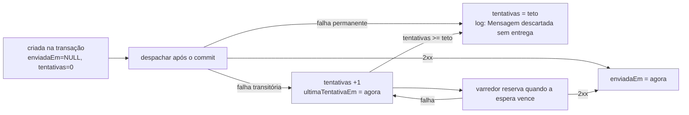

# WA Outbox e entrega

Volta para [[WhatsApp Suporte]] · desenho geral em [[WA Arquitetura]].

Código: [whatsapp/outbox.ts](../src/whatsapp/outbox.ts) (fila e varredor) e
[whatsapp/client.ts](../src/whatsapp/client.ts) (HTTP e retry).

## O problema que a outbox resolve

Antes, a resposta era enviada e só então o estado avançava — ou pior, o estado
avançava e o envio falhava. Resultado: **o usuário ficava esperando uma pergunta
que nunca chegou**, com a conversa já adiantada no banco.

Agora:

1. a resposta é gravada em `Mensagem` (`enviadaEm = NULL`, `payload` = o corpo
   exato a postar) **dentro da mesma transação** que muda a etapa;
2. o commit acontece;
3. o envio é tentado **fora** da transação;
4. se falhar, a linha continua pendente e o varredor tenta de novo.

De quebra, o histórico do chamado registra os dois lados da conversa mesmo com a
Evolution fora.

## Ciclo de vida de uma linha de saída



## Duas camadas de tentativa (não confundir)

| camada | onde | quantas | conta como `tentativas` no banco? |
| --- | --- | --- | --- |
| HTTP imediato | `postarComRetry` em [client.ts](../src/whatsapp/client.ts) | `ENVIOS_TENTATIVAS` = 3, com backoff 300/600/1200ms + jitter | **não** — as 3 juntas geram **uma** `tentativas +1` |
| varredor | `varrerPendentes` em [outbox.ts](../src/whatsapp/outbox.ts) | até `ENVIOS_MAX_TENTATIVAS` = 6 no total | sim, +1 por reserva |

Ou seja: `tentativas` no banco conta **rodadas**, não requisições HTTP. Uma
rodada pode ser 3 POSTs.

`ehTransitorio`: 408, 429 e 5xx valem repetir; os outros 4xx (token inválido,
destinatário inválido) são permanentes — repetir não ajuda e a linha vai direto
para o teto, com log.

## Espera crescente

`BACKOFF_BASE_SEGUNDOS = 30`, dobrando a cada tentativa gasta:

| tentativas | espera exigida antes da próxima |
| --- | --- |
| 0 | 30s |
| 1 | 1min |
| 2 | 2min |
| 3 | 4min |
| 4 | 8min |
| 5 | 16min |

Somando até o teto de 6: a mensagem sobrevive a **mais de meia hora** de Evolution
API fora. Ao atingir o teto, sai no log como `Mensagem descartada sem entrega` —
antes a linha só parava de aparecer nas varreduras e ninguém ficava sabendo.

## Alerta: o log sozinho não bastava

Desistir de uma mensagem é o **único** evento do sistema em que uma pessoa real
mandou mensagem e nunca recebeu resposta. Um `log.error` registra isso, mas só é
visto por quem estiver olhando os logs naquele momento — e ninguém está.

Com `ALERTA_WEBHOOK_URL` configurado (Slack, Discord ou qualquer coletor que
aceite JSON), a desistência vira um aviso no canal da equipe. Desligado por
padrão: sem a variável, nada é postado e o comportamento é exatamente o de
antes. Ver [alerta.ts](../src/alerta.ts).

Três decisões que valem o comentário:

- **Sem telefone e sem texto.** O destino é um canal de equipe, fora do controle
  de retenção deste sistema — o que entra lá não sai pelo `npm run retencao`. O
  `mensagemId` já basta para achar a linha no banco. Ver [[WA Segurança e LGPD]].
- **Coalescido.** Numa queda longa da Evolution, TODAS as pendentes estouram o
  teto de tentativas mais ou menos juntas. Sem janela (`ALERTA_INTERVALO_SEGUNDOS`,
  padrão 300s) o canal receberia centenas de avisos idênticos — e um canal assim
  é um canal que ninguém lê. O primeiro sai na hora; os seguintes da janela são
  contados e resumidos no próximo (`+N evento(s) semelhante(s)`).
- **Sem `await`.** A rede do alerta não pode atrasar o varredor nem a resposta do
  webhook da Evolution, e um alerta que falha não pode virar uma segunda falha: erro
  ao postar cai no log e o envio segue.

O corpo carrega `text` **e** `content` além dos campos estruturados, porque os
dois destinos prováveis esperam chaves diferentes (Slack lê `text`, Discord lê
`content`). Mandar os dois faz funcionar nos dois sem configuração de formato.

## A SQL de reserva

```sql
UPDATE "Mensagem"
   SET tentativas = tentativas + 1,
       "ultimaTentativaEm" = $agora        -- Date vindo do JS, não datetime('now')
 WHERE id IN (
   SELECT id FROM "Mensagem"
    WHERE remetente = 'sistema'
      AND "enviadaEm" IS NULL
      AND payload IS NOT NULL
      AND tentativas < $max
      AND unixepoch(coalesce("ultimaTentativaEm", "timestamp"), 'subsec')
          < unixepoch('now', 'subsec') - (30 * pow(2, tentativas))
    ORDER BY "timestamp"
    LIMIT $limite
 )
 RETURNING id, payload, tentativas
```

Três coisas dependem dela:

- **Reservar e marcar em uma instrução só.** `tentativas` e `ultimaTentativaEm`
  são atualizados no mesmo `UPDATE` que seleciona — não existe janela entre "vi a
  linha" e "marquei a linha". No SQLite a instrução é atômica por si, e é isso que
  substituiu o `FOR UPDATE SKIP LOCKED` que a versão em Postgres usava para duas
  instâncias não pegarem a mesma linha. Não há substituto porque não há o que
  substituir: um escritor por banco torna duas varreduras concorrentes
  impossíveis (ver [[WA Banco de dados]]).
- **`coalesce(ultimaTentativaEm, timestamp)`.** Antes o filtro olhava só
  `timestamp`, que é a hora de **criação** e nunca muda: passados os 30s
  iniciais a linha ficava elegível em *toda* varredura e as 6 tentativas se
  gastavam em cinco minutos. A coluna `ultimaTentativaEm` existe por causa disso.
- **`unixepoch(..., 'subsec')` nas duas pontas.** É o que torna a comparação de
  data correta — ver o aviso abaixo.

> [!danger] Aqui morava um bug de fuso horário, e a armadilha continua no mesmo lugar
> Esta comparação já deixou o varredor sem reenviar nada antes de a mensagem
> completar 3h de idade. A causa antiga (coluna `TIMESTAMP` sem fuso no Postgres,
> reinterpretada como hora local) **não existe mais**: o SQLite guarda a data como
> texto ISO-8601 com offset explícito, sempre em UTC.
>
> O que existe é a versão SQLite do mesmo erro. `datetime('now')` devolve
> `2026-08-27 19:57:00` — espaço em vez de `T`, sem milissegundo, sem offset — e
> comparado **como texto** com o valor da coluna, o `T` (0x54) é maior que o espaço
> (0x20). Resultado: toda pendente pareceria estar no futuro e nada seria
> reenviado, nunca. Daí o `unixepoch(..., 'subsec')` nas duas pontas, e daí o
> `$agora` vir como parâmetro `Date` em vez de `datetime('now')`.
>
> História completa em [[WA Fuso horário sem timezone]].

## Orçamento de tempo dentro da requisição

Quem entrega o webhook desiste de esperar o 200 em poucos segundos e **reentrega**.
Então o envio feito dentro da requisição tem `ENVIO_SINCRONO_MS` (10s) para o
**lote todo**: `ateMs = Date.now() + 10s` é calculado uma vez em
[app.ts](../src/app.ts) e passado adiante.

`postarComRetry` não começa tentativa que não caiba no orçamento — nem espera um
backoff que ultrapasse o limite — e o timeout de cada POST é
`min(8s, restante)`. O que não couber fica pendente e sai pelo varredor, que não
tem ninguém esperando do outro lado.

## Payload antigo depois de trocar de provedor

O `payload` é gravado uma vez e reenviado **literal** pelo varredor. Isso é o que
se quer no dia a dia — reenvio fiel, sem remontar nada — e foi exatamente o que
virou armadilha na saída da Meta em 2026-09-17.

Toda linha que estivesse **pendente no momento da troca** guarda o corpo da Meta
(`{messaging_product, to, type, text:{body}}`). A Evolution recusa isso com 400:
a mensagem queimaria as seis tentativas e morreria, e o alerta diria "desisti"
sem dizer por quê. Mensagem de gente real, perdida em silêncio.

`corpoParaEnvio` ([whatsapp/outbox.ts](../src/whatsapp/outbox.ts)) resolve sem
adivinhação: a própria linha guarda `telefone` e `texto`, que é tudo o que um
corpo da Evolution tem. Payload fora do formato é **reconstruído**, não
descartado — a pessoa recebe a mensagem que ficou presa — e a reconstrução deixa
um `log.warn` com o id da linha e as chaves que vieram.

```
"mensagemId":14,"chaves":["messaging_product","recipient_type","to","type","text"],
"msg":"payload fora do formato da Evolution; reconstruído a partir de telefone/texto"
```

O teste é pela **forma** (`number` e `text` presentes), e não pela presença de
campo da Meta: o que importa é se o corpo serve para a Evolution de hoje. Isso
faz a mesma rede pegar qualquer formato futuro que deixe de servir, e é o motivo
de `reservarLote` ter passado a devolver `telefone` e `texto` no `RETURNING`.

> [!note] Como isso apareceu
> Não apareceu sozinho. A **Evolution de mentira aceitava** corpo sem
> destinatário e respondia 201, então a linha era marcada como entregue e o
> problema ficava invisível em desenvolvimento — apareceria só em produção, como
> mensagem que some. O dublê passou a recusar com 400, como a real, e um teste
> (`pendente com payload no formato antigo é reconstruída, não descartada`)
> trava o comportamento.

## Entrega é "pelo menos uma vez"

Se o processo morrer entre o POST aceito e a marcação de `enviadaEm`, a mensagem
sai de novo. Escolha consciente: **repetir uma pergunta é melhor do que deixar a
pessoa no vácuo**. Não há deduplicação no lado de saída.

## Falha ao marcar no banco

Se o banco ficar inacessível na hora de gravar `enviadaEm`, o erro é logado e a
linha fica pendente. O varredor reavalia depois — o pior caso é reenviar.

## Aviso de indisponibilidade (o caminho sem banco)

[whatsapp/indisponibilidade.ts](../src/whatsapp/indisponibilidade.ts) existe para
quando o **próprio banco** está fora: aí a outbox não funciona, mas falar com a
Evolution é só HTTP.

- recebe **só os telefones que falharam**, não o lote inteiro — avisar quem foi
  atendido normalmente seria mentir;
- **um aviso por telefone a cada 10 minutos** (`INTERVALO_MS`), senão numa queda
  do banco o usuário receberia o mesmo texto em looping;
- orçamento próprio e curto: `AVISO_TIMEOUT_MS` = 3s, **uma** tentativa (em
  [app.ts](../src/app.ts)) — a requisição pode já ter gasto quase todo o
  `ENVIO_SINCRONO_MS`, e é melhor perder o aviso do que perder o 200 devido à
  Evolution;
- nunca lança: qualquer erro é logado com `erroSeguro` (um erro da Evolution pode
  trazer o telefone na mensagem).

## Notificação de mudança de situação

O mesmo mecanismo serve ao endpoint interno
([internal/chamados.ts](../src/internal/chamados.ts)): a notificação é
**enfileirada dentro** da transação que muda a situação e despachada depois do
commit. Se o envio falhar, **a mudança de situação continua valendo** — ela não
pode ser desfeita por uma falha de mensagem. Existe teste para exatamente isso.
